# 第七章、网络安全

> 学习内容来源网络，若有侵权联系：shaoyayu0419@qq.com删除
>
> 计算机网络谢希仁第七版网课

## 7.1  网络安全问题概述

随着计算机网络的发展，网络中的安全问题也日趋严重。

本节讨论计算机网络面临的安全性威胁、安全的内容和一般的数据加密模型。

### 7.1.1  计算机网络面临的安全性威胁

计算机网络上的通信面临以下两大类威胁：被动攻击和主动攻击。

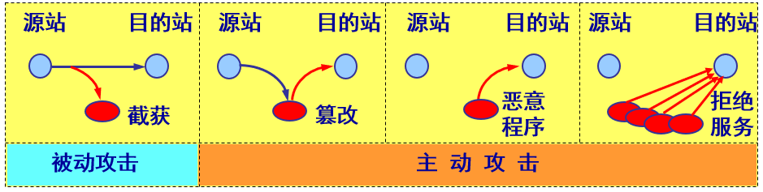

被动攻击

- 指攻击者从网络上窃听他人的通信内容。
- 通常把这类攻击成为截获。
- 在被动攻击中，攻击者只是观察和分析某一个协议数据单元 PDU，以便了解所交换的数据的某种性质。但不干扰信息流。
- 这种被动攻击又称为流量分析 (traffic analysis)。

主动攻击主要有：

(1) 篡改——故意篡改网络上传送的报文。这种攻击方式有时也称为更改报文流。
(2) 恶意程序——种类繁多，对网络安全威胁较大的主要包括：计算机病毒、计算机蠕虫、特洛伊木马、逻辑炸弹、后门入侵、流氓软件等。
(3) 拒绝服务——指攻击者向互联网上的某个服务器不停地发送大量分组，使该服务器无法提供正常服务，甚至完全瘫痪。

**分布式拒绝服务 DDoS**

若从互联网上的成百上千的网站集中攻击一个网站，则称为分布式拒绝服务 DDoS (Distributed Denial of Service)。

有时也把这种攻击称为网络带宽攻击或连通性攻击。

**计算机网络通信安全的目标**

对于主动攻击，可以采取适当措施加以检测。

对于被动攻击，通常却是检测不出来的。

根据这些特点，可得出计算机网络通信安全的目标：

- (1) 防止析出报文内容和流量分析。
- (2) 防止恶意程序。
- (3) 检测更改报文流和拒绝服务。

对付被动攻击可采用各种数据加密技术。

对付主动攻击则需将加密技术与适当的鉴别技术相结合。

### 7.1.2  安全的计算机网络

网络的安全性是不可判定的。
一个安全的计算机网络应达到四个目标：
1. 保密性
2. 端点鉴别
3. 信息的完整性
4. 运行的安全性

保密性：

    只有信息的发送方和接收方才能懂得所发送信息的内容。
    是网络安全通信的最基本的内容，也是对付被动攻击必须具备的功能。
    为了使网络具有保密性，需要使用各种密码技术。

端点鉴别：

    鉴别信息的发送方和接收方的真实身份。 
    在对付主动攻击中是非常重要的。

信息完整性：

    信息的内容未被篡改过。
    在应对主动攻击中是必不可少的。
    信息的完整性与端点鉴别往往是不可分割的。
    在谈到“鉴别”时，也同时包含了端点鉴别和报文完整性。

运动的安全性：

    系统能正常运行并提供服务。
    访问控制 (access control) 对计算机系统的安全性是非常重要的。必须对访问网络的权限加以控制，并规定每个用户的访问权限。

### 7.1.3  数据加密模型

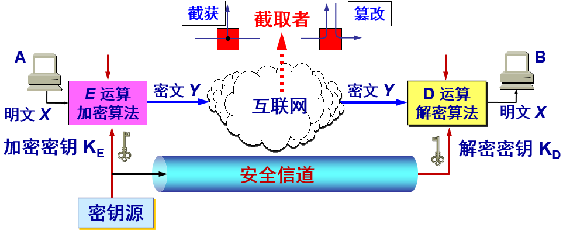

用户 A 向 B 发送明文 X，通过加密算法 E 运算后，就得出密文 Y。

密钥：

加密和解密用的密钥K (key) 是一串秘密的字符串（即比特串）。
明文通过加密算法 E  和加密密钥 K  变成密文：

接收端利用解密算法 D 运算和解密密钥 K 解出明文 X。解密算法是加密算法的逆运算。

- 加密密钥和解密密钥可以一样，也可以不一样。
- 密钥通常是由密钥中心提供。
- 当密钥需要向远地传送时，一定要通过另一个安全信道。

**一些重要概念** 

密码编码学 (cryptography) 是密码体制的设计学。

密码分析学 (cryptanalysis) 则是在未知密钥的情况下从密文推演出明文或密钥的技术。

密码编码学与密码分析学合起来即为密码学 (cryptology)。

如果不论截取者获得了多少密文，但在密文中都没有足够的信息来唯一地确定出对应的明文，则这一密码体制称为无条件安全的，或称为理论上是不可破的。

如果密码体制中的密码不能被可使用的计算资源破译，则这一密码体制称为在计算上是安全的。 

## 7.2  两类密码体制

### 7.2.1  对称密钥密码体制

所谓常规密钥密码体制，即加密密钥与解密密钥是相同的密码体制。

这种加密系统又称为对称密钥系统。

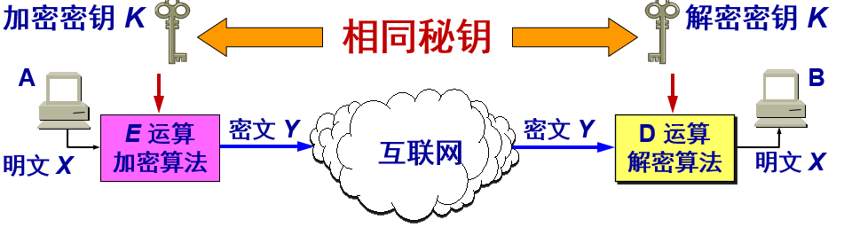

**数据加密标准 DES**

数据加密标准 DES 属于对称密钥密码体制，是一种分组密码。

在加密前，先对整个明文进行分组。每一个组长为 64 位。

然后对每一个 64 位 二进制数据进行加密处理，产生一组 64 位密文数据。

最后将各组密文串接起来，即得出整个的密文。

使用的密钥为 64 位（实际密钥长度为 56 位，有 8 位用于奇偶校验)。  

**数据加密标准 DES**

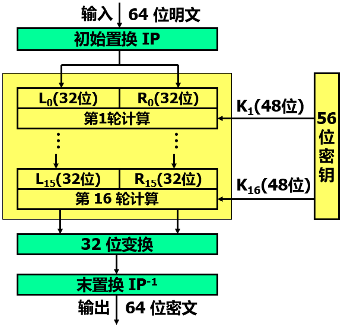

**DES 的保密性**

DES 的保密性仅取决于对密钥的保密，其算法是公开的。

目前较为严重的问题是 DES 的密钥的长度。

现在已经设计出搜索 DES 密钥的专用芯片。56位 DES 已不再认为是安全的了。    

**三重 DES**

使用两个 56 位的密钥。

把一个 64 位明文用一个密钥加密，再用另一个密钥解密，然后再使用第一个密钥加密，即

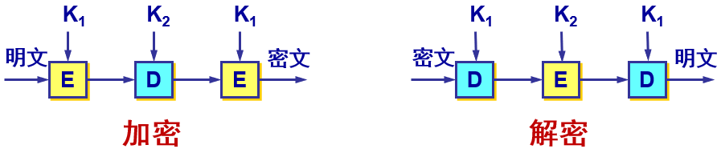

### 7.2.2  公钥密码体制

公钥密码体制（又称为公开密钥密码体制）使用不同的加密密钥与解密密钥，是一种“由已知加密密钥推导出解密密钥在计算上是不可行的”密码体制。 

公钥密码体制产生的主要原因：

- 常规密钥密码体制的密钥分配问题。
- 对数字签名的需求。

**加密密钥与解密密钥** 

在公钥密码体制中，加密密钥(即公钥) PK 是公开信息，而解密密钥(即私钥或秘钥) SK 是需要保密的。
加密算法 E 和解密算法 D 也都是公开的。
虽然秘钥 SK 是由公钥 PK 决定的，但却不能根据 PK 计算出 SK。 

**应当注意** 

任何加密方法的安全性取决于密钥的长度，以及攻破密文所需的计算量。在这方面，公钥密码体制并不具有比传统加密体制更加优越之处。 

由于目前公钥加密算法的开销较大，在可见的将来还看不出来要放弃传统的加密方法。

公钥还需要密钥分配协议，具体的分配过程并不比采用传统加密方法时更简单。  

**公钥算法的特点** 

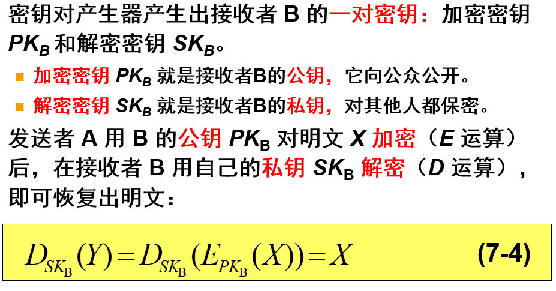

加密密钥是公开的，但不能用它来解密，即：

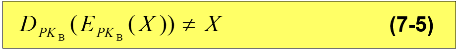

加密和解密运算可以对调，即加密和解密是互逆的：

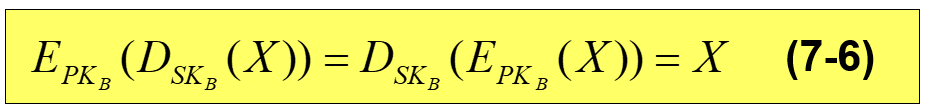

**公钥密码体制**

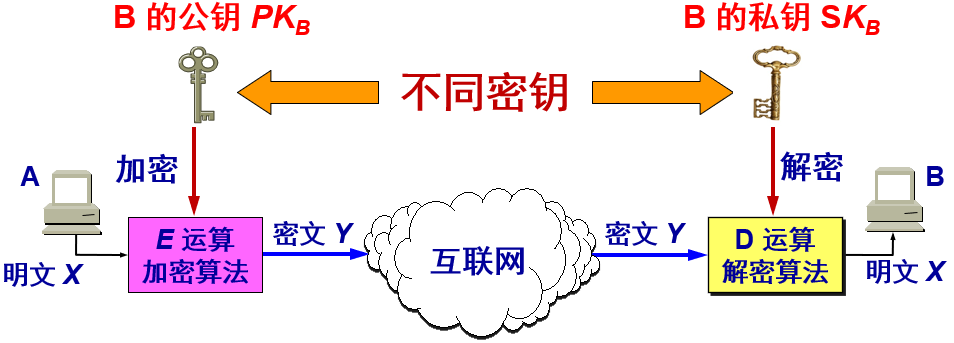

**公开密钥与对称密钥的区别**

在使用对称密钥时，由于双方使用同样的密钥，因此在通信信道上可以进行一对一的双向保密通信，每一方既可用此密钥加密明文，并发送给对方，也可接收密文，用同一密钥对密文解密。这种保密通信仅限于持有此密钥的双方（如再有第三方就不保密了）。

在使用公开密钥时，在通信信道上可以是多对一的单向保密通信。

**公钥密码体制**

如果某一信息用公开密钥加密，则必须用私有密钥解密，这就是实现保密的方法

如果某一信息用私有密钥加密，那么，它必须用公开密钥解密。这就是实现数字签名的方法

## 7.3  数字签名

用于证明真实性。

数字签名必须保证以下三点：

- (1) 报文鉴别——接收者能够核实发送者对报文的签名（证明来源）；
- (2) 报文的完整性——发送者事后不能抵赖对报文的签名（防否认）；
- (3) 不可否认——接收者不能伪造对报文的签名（防伪造）。

现在已有多种实现各种数字签名的方法。但采用公钥算法更容易实现。  

**基于公钥的数字签名的实现**

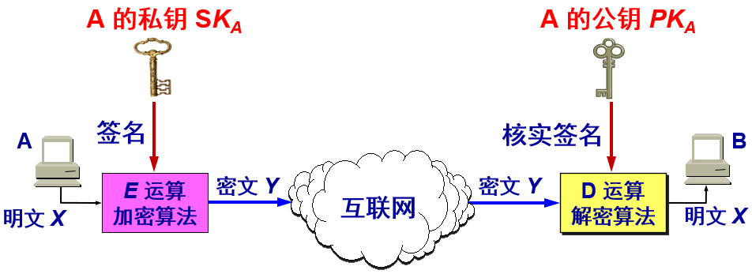

因为除 A 外没有别人能具有 A 的私钥，所以除 A 外没有别人能产生这个密文。因此 B 相信报文 X 是 A 签名发送的。

若 A 要抵赖曾发送报文给 B，B 可将明文和对应的密文出示给第三者。第三者很容易用 A 的公钥去证实 A 确实发送 X 给 B。

反之，若 B 将 X 伪造成 X‘，则 B 不能在第三者前出示对应的密文。这样就证明了 B 伪造了报文。  

**具有保密性的数字签名** 

同时实现秘密通信和数字签名

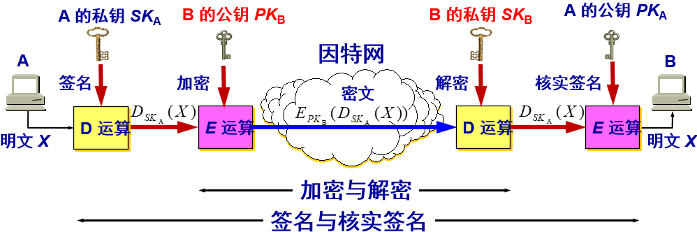

## 7.4  鉴别

在信息的安全领域中，对付被动攻击的重要措施是加密，而对付主动攻击中的篡改和伪造则要用鉴别 (authentication) 。

报文鉴别使得通信的接收方能够验证所收到的报文（发送者和报文内容、发送时间、序列等）的真伪。

使用加密就可达到报文鉴别的目的。但在网络的应用中，许多报文并不需要加密。应当使接收者能用很简单的方法鉴别报文的真伪。    

**鉴别与授权不同**

鉴别与授权 (authorization)是不同的概念。

授权涉及到的问题是：所进行的过程是否被允许（如是否可以对某文件进行读或写）。 

**鉴别分类**

可再把鉴别细分为两种。

1. 报文鉴别：即鉴别所收到的报文的确是报文的发送者所发送的，而不是其他人伪造的或篡改的。这就包含了端点鉴别和报文完整性的鉴别。
2. 实体鉴别：仅仅鉴别发送报文的实体。实体可以是一个人，也可以是一个进程（客户或服务器）。这就是端点鉴别。

### 7.4.1  报文鉴别

许多报文并不需要加密，但却需要数字签名，以便让报文的接收者能够鉴别报文的真伪。

然而对很长的报文进行数字签名会使计算机增加很大的负担（需要进行很长时间的运算）。

当我们传送不需要加密的报文时，应当使接收者能用很简单的方法鉴别报文的真伪。

#### 1. 密码散列函数

数字签名就能够实现对报文的鉴别。

但这种方法有一个很大的缺点：对较长的报文（这是很常见的）进行数字签名会使计算机增加非常大的负担，因为这需要进行较多的时间来进行运算。

密码散列函数 (cryptographic hash function)是一种相对简单的对报文进行鉴别的方法。

**散列函数的两个特点**

(1) 散列函数的输入长度可以很长，但其输出长度则是固定的，并且较短。散列函数的输出叫做散列值，或更简单些，称为散列。

(2) 不同的散列值肯定对应于不同的输入，但不同的输入却可能得出相同的散列值。这就是说，散列函数的输入和输出并非一一对应的，而是多对一的。

**密码散列函数的特点**

在密码学中使用的散列函数称为密码散列函数。

特点：单向性。

- 要找到两个不同的报文，它们具有同样的密码散列函数输出，在计算上是不可行的。
- 也就是说，密码散列函数实际上是一种单向函数 (one-way function)。

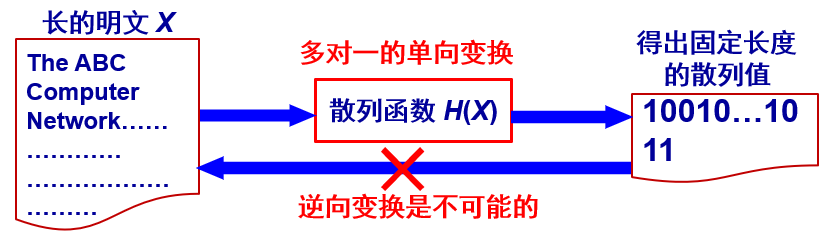

散列 H(X) 可用来保护明文X的完整性，防篡改和伪造。

#### 2. 实用的密码散列函数MD5和SHA-1

通过许多学者的不断努力，已经设计出一些实用的密码散列函数（或称为散列算法），其中最出名的就是 MD5 和 SHA-1。

报文摘要算法 MD5 公布于RFC 1321 (1991年)，并获得了非常广泛的应用。

SHA-1比 MD5 更安全，但计算起来却比 MD5 要慢些。

**MD5 算法**

MD5是报文摘要 MD (Message Digest) 的第5个版本。报文摘要算法MD5公布于RFC 1321 (1991年)，并获得了非常广泛的应用。

MD5 的设计者 Rivest曾提出一个猜想，即根据给定的 MD5 报文摘要代码，要找出一个与原来报文有相同报文摘要的另一报文，其难度在计算上几乎是不可能的。

基本思想：

- 用足够复杂的方法将报文的数据位充分“弄乱”，报文摘要代码中的每一位都与原来报文中的每一位有关。

计算步骤：

1，附加：把任意长的报文按模 264 计算其余数（64位），追加在报文的后面（长度项）。
2，填充：在报文和长度项之间填充 1512 位，使得填充后的总长度是 512 的整数倍。填充的首位是 1，后面都是 0。

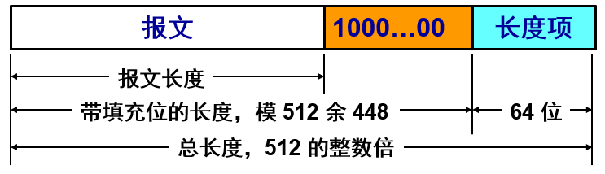

3，分组：把追加和填充后的报文分割为一个个 512 位的数据块，每个 512 位的报文数据再分成 4 个 128 位的数据块
4，计算：将 4 个 128 位的数据块依次送到不同的散列函数进行4轮计算。每一轮又都按 32 位的小数据块进行复杂的运算。一直到最后计算出 MD5 报文摘要代码（128位）。

**安全散列算法（SHA-1）**

安全散列算法 SHA (Secure Hash Algorithm)是由美国标准与技术协会 NIST 提出一个散列算法系列。

SHA 比 MD5 更安全，但计算起来却比 MD5 要慢些。

已制定 SHA-1、SHA-2、 SHA-3 等版本。

基本思想：

- 要求输入码长小于 264 位，输出码长为 160 位。
- 将明文分成若干 512 位的定长块，每一块与当前的报文摘要值结合，产生报文摘要的下一个中间结果，直到处理完毕
- 共扫描 5 遍，效率略低于 MD5，抗穷举性更高。

#### 3. 报文鉴别码 MAC

MD5 实现的报文鉴别可以防篡改，但不能防伪造，因而不能真正实现报文鉴别。
例如：

- 入侵者创建了一个伪造的报文M，然后计算出其散列 H(M)，并把拼接有散列的扩展报文冒充 A 发送给 B。
- B 收到扩展的报文 (M, H(M)) 后， 通过散列函数的运算，计算出收到的报文 MR 的散列 H(MR)。
- 若 H(M) = H(MR)，则 B 就会误认为所收到的伪造报文就是 A 发送的。

为防范上述攻击，可以对散列进行一次加密。

散列加密后的结果叫做报文鉴别码 MAC (Message Authentication Code)。

由于入侵者不掌握密钥 K，所以入侵者无法伪造 A 的报文鉴别码 MAC，因而无法伪造 A 发送的报文。这样就完成了对报文的鉴别。

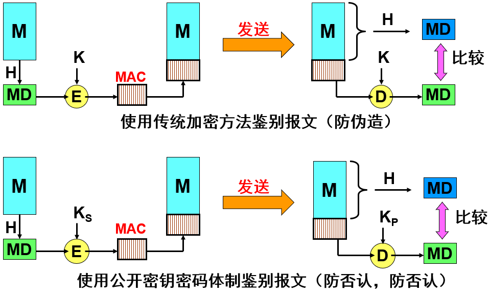

注意到，现在整个的报文是不需要加密的。

虽然从散列H导出报文鉴别码 MAC 需要加密算法，但由于散列 H 的长度通常都远远小于报文 X 的长度，因此这种加密不会消耗很多的计算资源。

因此，使用鉴别码 MAC 就能够很方便地保护报文的完整性。

### 7.4.2  实体鉴别

实体鉴别与报文鉴别不同。

报文鉴别是对每一个收到的报文都要鉴别报文的发送者。

实体鉴别是在系统接入的全部持续时间内对和自己通信的对方实体只需验证一次。 

**最简单的实体鉴别过程** 

可以使用共享的对称密钥实现实体鉴别。

A 发送给 B 的报文的被加密，使用的是对称密钥 KAB。

B 收到此报文后，用共享对称密钥 KAB 进行解密，因而鉴别了实体 A 的身份。 因为该密钥只有 A 和 B 知道。

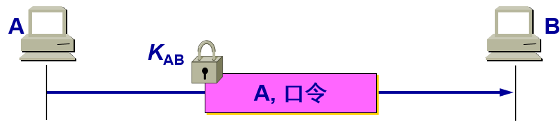

**存在明显漏洞**

入侵者 C 可以从网络上截获 A 发给 B 的报文。

C 并不需要破译这个报文，而是直接把这个截获的、由A加密的报文发送给 B，使 B 误认为 C 就是 A。然后 B 就向伪装是 A 的 C 发送应发给 A 的报文。

这种攻击被称为重放攻击(replay attack)。C 甚至还可以截获 A 的 IP 地址，然后把 A 的 IP 地址冒充为自己的 IP 地址（这叫做 IP 欺骗），使 B 更加容易受骗。 

**使用不重数进行鉴别**

不重数(nonce)就是一个不重复使用的大随机数，即“一次一数”。由于不重数不能重复使用，所以 C 在进行重放攻击时无法重复使用所截获的不重数。

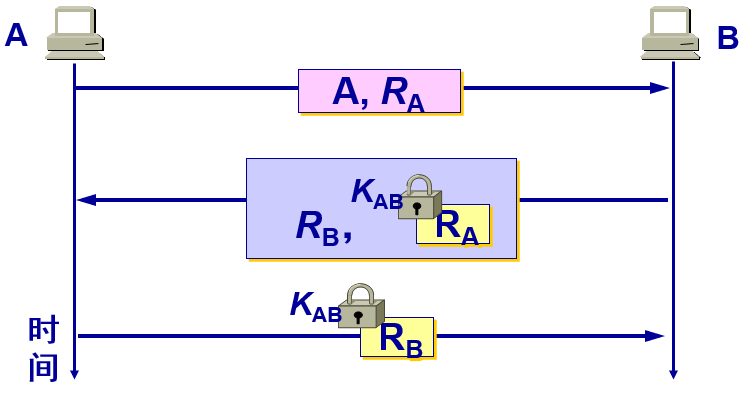

在使用公钥密码体制时，可以对不重数进行签名鉴别。

B 用其私钥对不重数 RA 进行签名后发回给 A。A 用 B 的公钥核实签名。如能得出自己原来发送的不重数 RA，就核实了和自己通信的对方的确是 B。

同样，A 也用自己的私钥对不重数 RB 进行签名后发送给 B。B 用 A 的公钥核实签名，鉴别了 A 的身份。

公钥密码体制虽然不必在互相通信的用户之间秘密地分配共享密钥，但仍有受到攻击的可能。

- C 冒充是 A，发送报文给 B，说：“我是 A”。
  B 选择一个不重数 RB，发送给 A，但被 C 截获了。
  C 用自己的私钥 SKC 冒充是A的私钥，对 RB 加密，并发送给 B。
  B 向 A 发送报文，要求对方把解密用的公钥发送过来，但这报文也被 C 截获了。
  C 把自己的公钥 PKC 冒充是 A 的公钥发送给 B。
  B 用收到的公钥 PKC 对收到的加密的 RB 进行解密，其结果当然正确。于是 B 相信通信的对方是 A，接着就向 A 发送许多敏感数据，但都被 C 截获了。

**中间人攻击** 

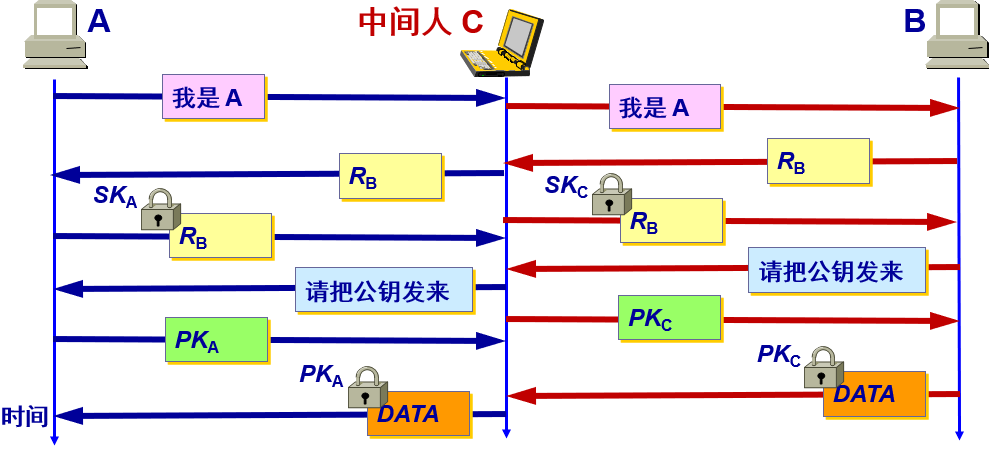

由此可见，公钥的分配以及认证公钥的真实性也是一个非常重要的问题。

**中间人攻击说明**

A 向 B 发送“我是 A”的报文，并给出了自己的身份。此报文被“中间人” C 截获，C 把此报文原封不动地转发给 B。B 选择一个不重数 RB 发送给 A，但同样被 C 截获后也照样转发给 A。

中间人 C 用自己的私钥 SKC 对 RB 加密后发回给 B，使 B 误以为是 A 发来的。A 收到 RB 后也用自己的私钥 SKA 对 RB 加密后发回给 B，中途被 C 截获并丢弃。B 向 A 索取其公钥，此报文被 C截获后转发给 A。

C 把自己的公钥 PKC 冒充是 A 的发送给 B，而 C 也截获到 A 发送给 B 的公钥 PKA。

B 用收到的公钥 PKC（以为是 A 的）对数据加密发送给 A。C 截获后用自己的私钥 SKC 解密，复制一份留下，再用 A 的公钥 PKA 对数据加密后发送给 A。

A 收到数据后，用自己的私钥 SKA 解密，以为和B进行了保密通信。其实，B发送给A的加密数据已被中间人 C 截获并解密了一份。但 A 和 B 却都不知道。 

## 7.5  密钥分配

由于密码算法是公开的，网络的安全性就完全基于密钥的安全保护上。因此在密码学中出现了一个重要的分支——密钥管理。

密钥管理包括：密钥的产生、分配、注入、验证和使用。本节只讨论密钥的分配。

密钥分配是密钥管理中最大的问题。密钥必须通过最安全的通路进行分配。

网外分配方式：派非常可靠的信使携带密钥分配给互相通信的各用户。

网内分配方式：密钥自动分配。

<u>但随着用户的增多和网络流量的增大，密钥更换频繁（密钥必须定期更换才能做到可靠），派信使的办法已不再适用，而应采用网内分配方式。</u>

### 7.5.1  对称密钥的分配

目前常用的密钥分配方式是设立密钥分配中心 KDC (Key Distribution Center)。

KDC 是大家都信任的机构，其任务就是给需要进行秘密通信的用户临时分配一个会话密钥（仅使用一次）。

假设用户 A 和 B 都是 KDC 的登记用户，并已经在 KDC 的服务器上安装了各自和 KDC 进行通信的主密钥（master key）KA 和 KB。 “主密钥”可简称为“密钥”。  

**对称密钥的分配**

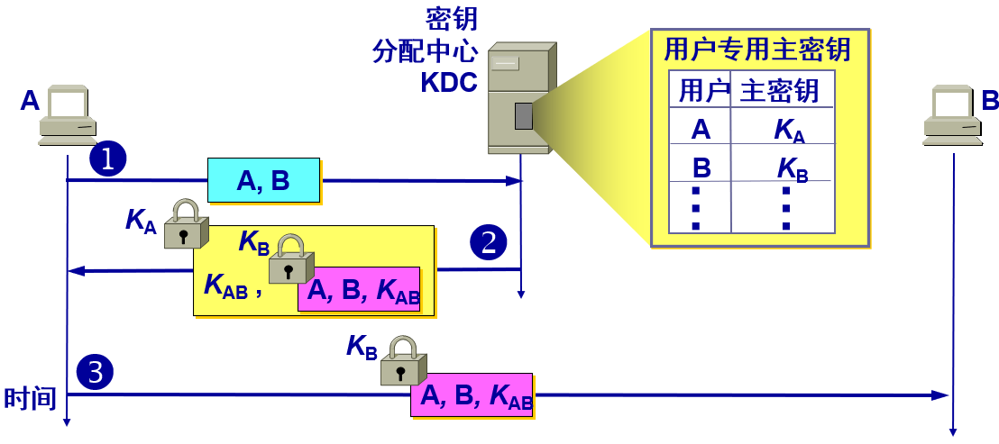

**对称密钥的分配说明**

1. 用户 A 向密钥分配中心 KDC 发送时用明文，说明想和用户B通信。在明文中给出 A 和 B 在 KDC 登记的身份。
2. KDC 用随机数产生“一次一密”的会话密钥 KAB 供 A 和 B 的这次会话使用，然后向 A 发送回答报文。这个回答报文用 A 的密钥 KA 加密。这个报文中包含有这次会话使用的密钥 KAB 和请 A 转给 B 的一个票据(ticket)，它包含 A 和 B 在 KDC 登记的身份，以及这次会话将要使用的密钥 KAB。这个票据用B的密钥 KB 加密，因此 A 无法知道此票据的内容，因为 A 没有 B 的密钥 KB。当然 A 也不需要知道此票据的内容。
3. 当 B 收到 A 转来的票据并使用自己的密钥 KB 解密后，就知道 A 要和他通信，同时也知道 KDC 为这次和 A 通信所分配的会话密钥 KAB 。
4. 此后，A 和 B 就可使用会话密钥 KAB 进行这次通信了。

**Kerberos**

目前最出名的密钥分配协议是 Kerberos V5。

Kerberos 既是鉴别协议，同时也是 KDC，它已经变得很普及，现在是互联网建议标准。

Kerberos 使用比 DES 更加安全的高级加密标准 AES进行加密。

Kerberos 使用两个服务器：鉴别服务器AS (Authentication Server)、票据授予服务器TGS (Ticket-Granting Server)。

Kerberos 只用于客户与服务器之间的鉴别，而不用于人对人的鉴别。

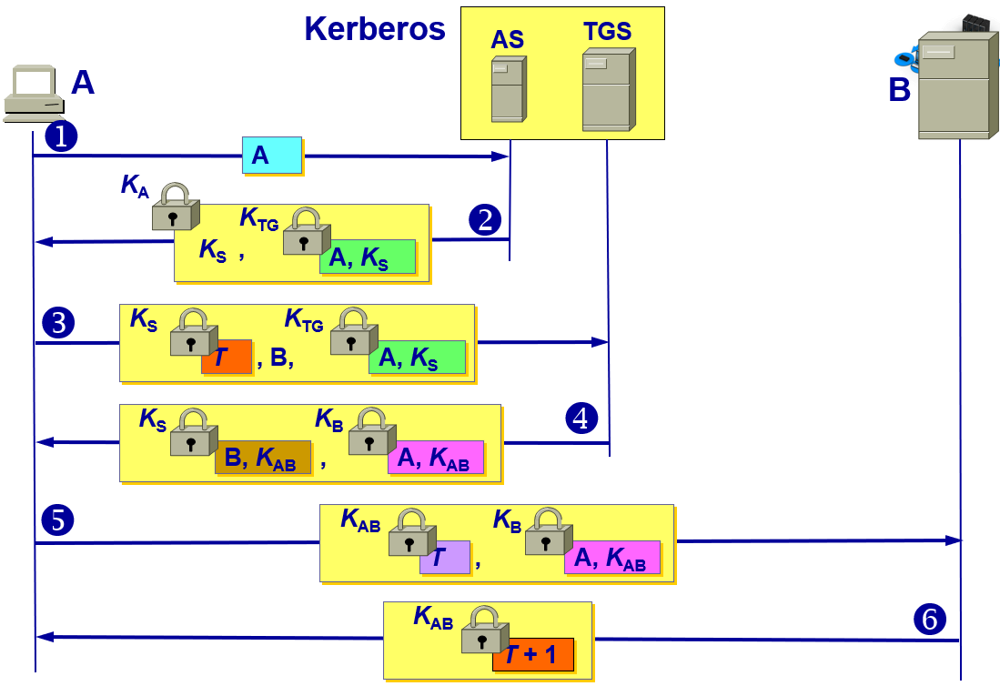

**Kerberos密钥分配说明**

1. A 用明文（包括登记的身份）向鉴别服务器 AS 表明自己的身份。
2. AS 向 A 发送用 A 的对称密钥 KA 加密的报文，这个报文包含A和TGS通信的会话密钥 KS ，以及 AS 要发送给 TGS 的票据（这个票据是用 TGS 的对称密钥 KTG 加密的）。

3. A 向 TGS 发送三个项目：

   转发鉴别服务器 AS 发来的票据。

   服务器 B 的名字。这表明 A 请求 B 的服务。请注意，现在 A 向 TGS 证明自己的身份并非通过键入口令（因为入侵者能够从网上截获明文口令），而是通过转发 AS 发出的票据（只有 A 才能提取出）。票据是加密的，入侵者伪造不了。

   用 KS 加密的时间戳 T。它用来防止入侵者的重放攻击。

4. TGS 发送两个票据，每一个都包含 A 和 B 通信的会话密钥 KAB。给 A 的票据用 KS 加密；给 B 的票据用 B 的密钥 KB 加密。请注意，现在入侵者不能提取 KAB，因为不知道 KA 和 KB。入侵者也不能重放步骤，因为入侵者不能把时间戳更换为一个新的（因为不知道  KS）。

5. A 向 B 转发 TGS 发来的票据，同时发送用 KAB 加密的时间戳 T。
6.  B 把时间戳 T 加 1 来证实收到了票据。B 向 A 发送的报文用密钥 KAB 加密。
   以后，A 和 B 就使用 TGS 给出的会话密钥 KAB 进行通信。

**Kerberos 使用两个服务器**

Kerberos 要求所有使用 Kerberos 的主机必须在时钟上进行“松散的”同步。

所谓“松散的”同步是要求所有主机的时钟误差不能太大，例如，不能超过 5 分钟的数量级。

这个要求是为了防止重放攻击。

### 7.5.2  公钥的分配

在公钥密码体制中，如果每个用户都具有其他用户的公钥，就可实现安全通信。

看来好像可以随意公布用户的公钥。其实不然。

设想用户 A 要欺骗用户 B。A 可以向 B 发送一份伪造是 C 发送的报文。A 用自己的秘密密钥进行数字签名，并附上 A 自己的公钥，谎称这公钥是 C 的。B 如何知道这个公钥不是 C 的呢？

需要有一个值得信赖的机构——即认证中心 CA (Certification Authority)，来将公钥与其对应的实体（人或机器）进行绑定(binding)。

认证中心一般由政府出资建立。每个实体都有 CA  发来的证书(certificate)，里面有公钥及其拥有者的标识信息。此证书被 CA 进行了数字签名。任何用户都可从可信的地方获得认证中心 CA 的公钥，此公钥用来验证某个公钥是否为某个实体所拥有。

有的大公司也提供认证中心服务。 

**CA 证书**

CA 证书具有统一的格式，ITU-T 制定了 X.509 协议标准，用来描述证书的结构。

在 X.509 中规定要使用 ASN.1。

IETF 接受了 X.509（仅有少量的改动），并在 RFC 5280（现在是建议标准）中给出了互联网 X.509 公钥基础结构 PKI (Public Key Infrastructure)。

## 7.6  互联网使用的安全协议

### 7.6.1  网络层安全协议

IP几乎不具备任何安全性，不能保证：

- 数据机密性；
- 数据完整性；
- 数据来源认证

由于其在设计和实现上存在安全漏洞，使各种攻击有机可乘。例如：攻击者很容易构造一个包含虚假地址的 IP 数据报。

IPsec 提供了标准、健壮且包含广泛的机制保证IP 层安全。

IP 安全性很差，不能保证：

- 没有为通信提供良好的数据源鉴别机制；
- 没有为数据提供强大的完整性保护机制；
- 没有为数据提供任何机密性保护；
- 在设计和实现上存在安全漏洞，使各种攻击有机可乘。例如：攻击者很容易构造一个包含虚假地址的IP数据报。

#### 1.  IPsec 协议

IPsec 就是“IP安全(security)”的缩写。

IPsec 并不是一个单个的协议，而是能够在 IP 层提供互联网通信安全的协议族。

IPsec 是个框架，它允许通信双方选择合适的算法和参数（例如，密钥长度）。

为保证互操作性，IPsec 还包含了所有 IPsec 的实现都必须有的一套加密算法。

**IPsec 由三部分组成**

1，IP 安全数据报格式的两个协议
		鉴别首部 AH (Authentication Header)协议
				提供源点鉴别和数据完整性，但不能保密。
		封装安全有效载荷 ESP (Encapsulation Security Payload)协议
				提供源点鉴别、数据完整性和保密。
2，有关加密算法的三个协议（在此不讨论）。
3，互联网密钥交换 IKE (Internet Key Exchange)协议。

**IP 安全数据报有两种工作方式**

1，运输方式 (transport mode)：

- 在整个运输层报文段的前后分别添加若干控制信息，再加上 IP 首部，构成 IP 安全数据报。
- 把整个运输层报文段都保护起来，适合于主机到主机之间的安全传送。 
- 需要使用 IPsec 的主机都运行 IPsec协议。

2，隧道方式 (tunnel mode)：

- 在原始的 IP 数据报的前后分别添加若干控制信息，再加上新的 IP 首部，构成一个 IP 安全数据报。
- 这需要在 IPsec 数据报所经过的所有路由器上都运行 IPsec 协议。
- 隧道方式常用来实现虚拟专用网 VPN。

无论使用哪种方式，最后得出的 IP 安全数据报的 IP 首部都是不加密的。

所谓“安全数据报”是指数据报的数据部分是经过加密的，并能够被鉴别的。

通常把数据报的数据部分称为数据报的有效载荷(payload)。

**安全关联 SA**

在使用 AH 或 ESP 之前，先要从源主机到目的主机建立一条网络层的逻辑连接。此逻辑连接叫做安全关联 SA (Security Association) 。

 IPsec 就把传统互联网无连接的网络层转换为具有逻辑连接的网络层。 

**安全关联的特点**

- 安全关联是从源点到终点的单向连接，它能够提供安全服务。
- 在安全关联 SA 上传送的就是 IP 安全数据报。
- 如要进行双向安全通信，则两个方向都需要建立安全关联。
- 若 n 个员工进行双向安全通信，一共需要创建 (2 + 2n) 条安全关联 SA。

**路由器 R1 到 R2 的安全关联 SA**

假定公司总部的主机 H1 要和分公司的主机 H2 通过互联网进行安全通信。公司总部与分公司之间的安全关联 SA 就是在路由器 R1 和 R2 之间建立的。

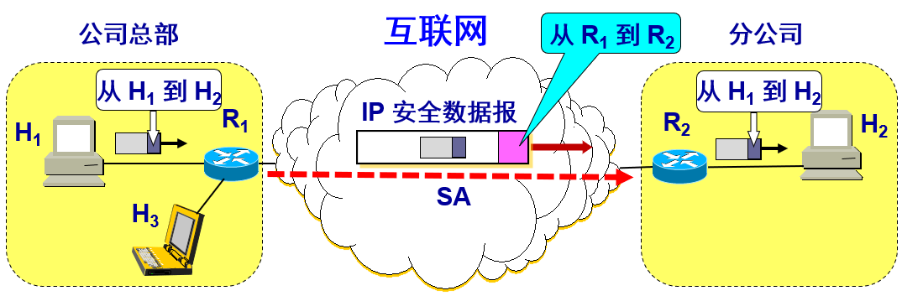

**安全关联 SA 状态信息**

(1) 一个 32 位的连接标识符，称为安全参数索引 SPI (Security Parameter Index)。
(2) 安全关联 SA 的源点和终点的 IP 地址（例如路由器 R1 和 R2 的 IP 地址）。
(3) 所使用的加密类型（例如，DES 或 AES）。
(4) 加密的密钥。
(5) 完整性检查的类型（例如，使用报文摘要 MD5 或 SHA-1 的报文鉴别码 MAC）。
(6) 鉴别使用的密钥。

#### 2. IP 安全数据报的格式

隧道方式下的 IP 安全数据报的格式

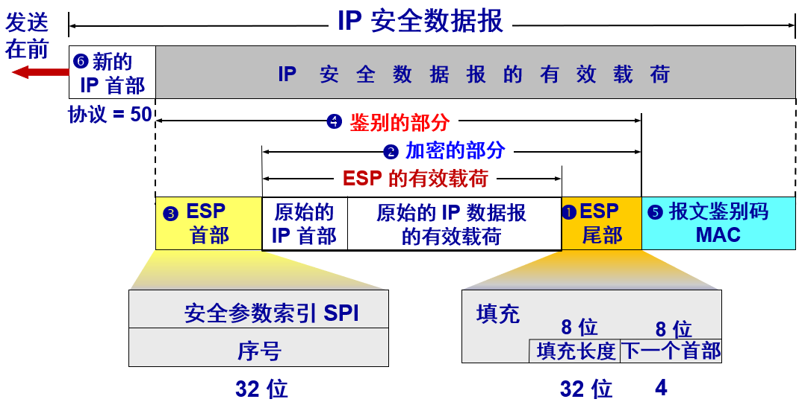

#### 3. IPsec 的其他构件 

- 安全关联数据库 SAD (Security Association Database)  
  	存放SA。
- 安全策略数据库 SPD (Security Policy Database) 
  	指明什么样的数据报需要进行 IPsec 处理。
- 互联网密钥交换 IKE (Internet Key Exchange) 
  	为IP安全数据报创建安全关联SA。

**互联网密钥交换 IKE**

IKE 是个非常复杂的协议，在2014年10月已成为互联网的正式标准 [RFC 7296]。
以另外三个协议为基础：

- (1) Oakley——是密钥生成协议[RFC 2412]。
- (2) 安全密钥交换机制 SKEME (Secure Key Exchange Mechanism) ——是用于密钥交换的协议。它利用公钥加密来实现密钥交换协议中的实体鉴别。
- (3) 互联网安全关联和密钥管理协议 ISAKMP (Internet Secure Association and Key Management Mechanism) ——用于实现IKE中定义的密钥交换，使IKE的交换能够以标准化、格式化的报文创建安全关联 SA。

### 7.6.2  运输层的安全协议

现在广泛使用的有以下两个协议： 

安全套接字层 SSL (Secure Socket Layer) 

运输层安全 TLS (Transport Layer Security) 

**SSL 和 TLS**

安全套接层 SSL 由Netscape于1994年开发，广泛应用于基于万维网的各种网络应用（但不限于万维网应用）。

SSL 作用在端系统应用层的 HTTP 和运输层之间，在 TCP 之上建立起一个安全通道，为通过 TCP 传输的应用层数据提供安全保障。

1996年发布 SSL 3.0，成为 Web 安全的事实标准。

1999年，IETF 在 SSL 3.0 基础上推出了传输层安全标准 TLS，为所有基于 TCP 的网络应用提供安全数据传输服务。

**SSL / TLS 的位置** 

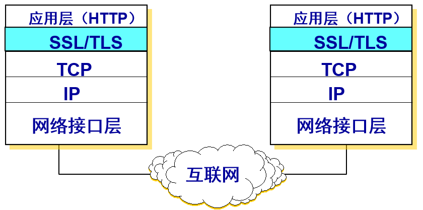

在发送方，SSL 接收应用层的数据，对数据进行加密，然后把加了密的数据送往 TCP 套接字。在接收方，SSL 从 TCP 套接字读取数据，解密后把数据交给应用层。 

**SSL 和 TLS**

SSL / TLS建立在可靠的 TCP 之上，与应用层协议独立无关。

SSL / TLS 已被所有常用的浏览器和万维网服务器所支持。

SSL / TLS基本目标：实现两个应用实体之间的安全可靠通信。

应用层使用 SSL 最多的就是 HTTP，但 SSL 并非仅用于 HTTP，而是可用于任何应用层的协议。

应用程序 HTTP 调用 SSL 对整个网页进行加密时，网页上会提示用户，在网址栏原来显示 http 的地方，现在变成了 https。在 http 后面加上的s代表 security，表明现在使用的是提供安全服务的 HTTP 协议（TCP 的 HTTPS 端口号是 443，而不是平时使用的端口号 80）。

**SSL 提供的安全服务**

(1)	SSL 服务器鉴别，允许用户证实服务器的身份。支持 SSL 的客户端通过验证来自服务器的证书，来鉴别服务器的真实身份并获得服务器的公钥。
(2)	SSL 客户鉴别，SSL 的可选安全服务，允许服务器证实客户的身份。
(3)	加密的 SSL 会话，对客户和服务器间发送的所有报文进行加密，并检测报文是否被篡改。

**SSL 安全会话建立过程**

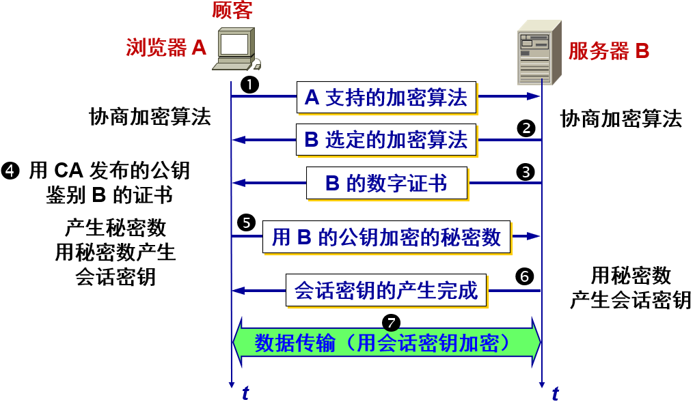

(1) 协商加密算法。1 浏览器 A 向服务器 B 发送浏览器的 SSL 版本号和一些可选的加密算法。2  B 从中选定自己所支持的算法（如RSA），并告知 A。
(2) 服务器鉴别。3  服务器 B 向浏览器 A 发送包含其 RSA 公钥的数字证书。4  A 使用该证书的认证机构 CA 的公开发布的RSA公钥对该证书进行验证。
(3) 会话密钥计算。由浏览器 A 随机产生一个秘密数。5 用服务器 B 的 RSA 公钥进行加密后发送给 B。6 双方根据协商的算法产生共享的对称会话密钥。
(4) 安全数据传输。7 双方用会话密钥加密和解密它们之间传送的数据并验证其完整性。

### 7.6.3  应用层的安全协议

本节仅讨论应用层中有关电子邮件的安全协议。

发送电子邮件是个即时的行为。发送方 A 和接收方 B 并不会为此而建立任何会话。

电子邮件安全协议就应当为每种加密操作定义相应的算法，以及密钥管理、鉴别、完整性保护等方法。

**PGP (Pretty Good Privacy)**

PGP (Pretty Good Privacy)  是一个完整的电子邮件安全软件包，包括加密、鉴别、电子签名和压缩等技术。

PGP 并没有使用什么新的概念，它只是将现有的一些算法如 MD5，RSA，以及 IDEA 等综合在一起而已。

虽然 PGP 已被广泛使用，但 PGP 并不是互联网的正式标准。  

**PGP 工作原理**

PGP 提供电子邮件的安全性、发送方鉴别和报文完整性。

假定 A 向 B 发送电子邮件明文 X，使用 PGP 进行加密。
A 有三个密钥：A 的私钥、B 的公钥和 A 生成的一次性密钥。
B 有两个密钥：B 的私钥和 A 的公钥。

在发送方 A 的 PGP 处理过程

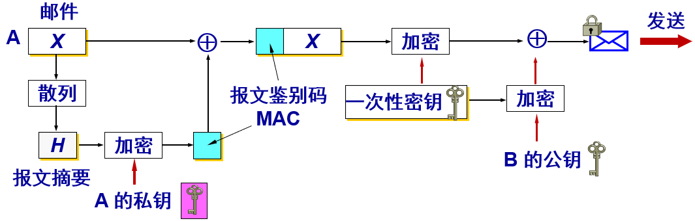

**发送方 A 的工作**

(1) 对明文邮件 X 进行 MD5 运算，得出 MD5 报文摘要 H。用 A 的私钥对 H 进行加密（即数字签名），得出报文鉴别码 MAC，把它拼接在明文 X 后面，得到扩展的邮件 (X, MAC)。
(2) 使用 A 自己生成的一次性密钥对扩展的邮件 (X, MAC)进行加密。
(3) 用 B 的公钥对 A 生成的一次性密钥进行加密。
(4) 把加了密的一次性密钥和加了密的扩展的邮件发送给 B。

**PGP 工作原理**

PGP 提供电子邮件的安全性、发送方鉴别和报文完整性。

假定 A 向 B 发送电子邮件明文 X，使用 PGP 进行加密。
A有三个密钥：A 的私钥、B 的公钥和 A 生成的一次性密钥。
B有两个密钥：B 的私钥和 A 的公钥。

在接收方 B 的 PGP 处理过程

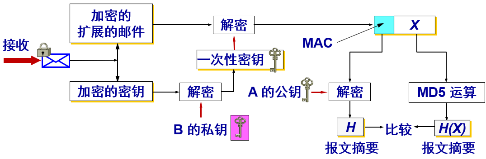

**接收方 B 的工作**

(1) 把被加密的一次性密钥和被加密的扩展报文 (X, MAC) 分离开。
(2) 用 B 自己的私钥解出 A 的一次性密钥。
(3) 用解出的一次性密钥对报文进行解密，然后分离出明文 X 和 MAC。
(4) 用 A 的公钥对 MAC 进行解密（即签名核实），得出报文摘要 H。这个报文摘要就是 A 原先用明文邮件 X 通过 MD5 运算生成的那个报文摘要。
(5) 对分离出的明文邮件 X 进行 MD5 报文摘要运算，得出另一个报文摘要 H(X)。把 H(X) 和前面得出的 H 进行比较，是否和一样。如一样，则对邮件的发送方的鉴别就通过了，报文的完整性也得到肯定。

## 7.7  系统安全：防火墙与入侵检测

### 7.7.1  防火墙

防火墙是由软件、硬件构成的系统，是一种特殊编程的路由器，用来在两个网络之间实施访问控制策略。

访问控制策略是由使用防火墙的单位自行制订的，为的是可以最适合本单位的需要。

防火墙内的网络称为“可信的网络”(trusted network)，而将外部的因特网称为“不可信的网络”(untrusted network)。

防火墙可用来解决内联网和外联网的安全问题。

**防火墙在互连网络中的位置** 

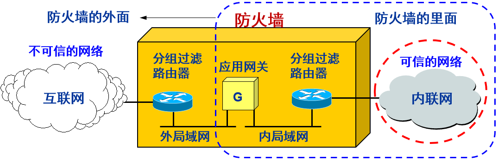

**防火墙的功能**

防火墙的功能有两个：阻止和允许。

“阻止”就是阻止某种类型的通信量通过防火墙（从外部网络到内部网络，或反过来）。

“允许”的功能与“阻止”恰好相反。

防火墙必须能够识别通信量的各种类型。不过在大多数情况下防火墙的主要功能是“阻止”。

**防火墙技术一般分为两类** 

分组过滤路由器

- 是一种具有分组过滤功能的路由器，它根据过滤规则对进出内部网络的分组执行转发或者丢弃（即过滤）。过滤规则基于分组的网络层或运输层首部的信息，例如：源/目的 IP 地址、源/目的端口、协议类型（TCP 或 UDP）等。
- 分组过滤可以是无状态的，即独立地处理每一个分组。也可以是有状态的，即要跟踪每个连接或会话的通信状态，并根据这些状态信息来决定是否转发分组。

应用网关也称为代理服务器(proxy server)

- 它在应用层通信中扮演报文中继的角色。
- 一种网络应用需要一个应用网关，例如 万维网缓存就是一种万维网应用的代理服务器。
- 在应用网关中，可以实现基于应用层数据的过滤和高层用户鉴别。
- 所有进出网络的应用程序报文都必须通过应用网关。
- 应用网关也有一些缺点：
  - 首先，每种应用都需要一个不同的应用网关。
  - 其次，在应用层转发和处理报文，处理负担较重。
  - 另外，对应用程序不透明，需要在应用程序客户端配置应用网关地址。

### 7.7.2  入侵检测系统

防火墙试图在入侵行为发生之前阻止所有可疑的通信。

入侵检测系统 IDS (Intrusion Detection System)能够在入侵已经开始，但还没有造成危害或在造成更大危害前，及时检测到入侵，以便尽快阻止入侵，把危害降低到最小。  

IDS 对进入网络的分组执行深度分组检查，当观察到可疑分组时，向网络管理员发出告警或执行阻断操作（由于 IDS 的“误报”率通常较高，多数情况不执行自动阻断）。

IDS 能用于检测多种网络攻击，包括网络映射、端口扫描、DoS 攻击、蠕虫和病毒、系统漏洞攻击等。

**两种入侵检测方法**

基于特征的 IDS 维护一个所有已知攻击标志性特征的数据库。

这些特征和规则通常由网络安全专家生成，机构的网络管理员定制并将其加入到数据库中。

基于特征的 IDS 只能检测已知攻击，对于未知攻击则束手无策。  

**基于异常的 IDS** 通过观察正常运行的网络流量，学习正常流量的统计特性和规律。当检测到网络中流量某种统计规律不符合正常情况时，则认为可能发生了入侵行为。

<u>至今为止，大多数部署的 IDS 主要是基于特征的，尽管某些 IDS 包括了某些基于异常的特性。</u>

## 7.8  一些未来的发展方向

网络安全是一个很大的领域。对于有志于这一领域的读者，可在下面几个方向作进一步的研究：
1．椭圆曲线密码 (Elliptic Curve Cryptography，简写为 ECC) 与 AES —— 这一系统现在已广泛用于电子护照中，也是下一代金融系统使用的加密系统。
2．移动安全 (Mobile Security) —— 移动通信带来的广泛应用（如移动支付，Mobile Payment）向网络安全提出了更高的要求。
3．量子密码 (Quantum Cryptography) —— 量子计算机的到来将使得目前许多使用中的密码技术无效，后量子密码学（Post-Quantum Cryptography）的研究方兴未艾。

