# 第 8 章  互联网上的音频/视频服务 

> 学习内容来源网络，若有侵权联系：shaoyayu0419@qq.com删除
>
> 计算机网络谢希仁第七版网课

## 8.1  概述

计算机网络最初是为传送数据信息设计的。互联网 IP 层提供的“尽最大努力交付”服务，以及每一个分组独立交付的策略，对传送数据信息也是很合适的。
互联网使用的 TCP 协议可以很好地解决网络不能提供可靠交付这一问题。

**多媒体信息的特点**

多媒体信息（包括声音和图像信息）与不包括声音和图像的数据信息有很大的区别。
1，多媒体信息的信息量往往很大。
2，在传输多媒体数据时，对时延和时延抖动均有较高的要求。
3，多媒体数据往往是实时数据 (real time data)，它的含义是：在发送实时数据的同时，在接收端边接收、边播放。 

**互联网是非等时的** 

模拟的多媒体信号经过采样和模数转换变为数字信号，再组装成分组。这些分组的发送速率是恒定的（等时的）。
传统的互联网本身是非等时的。因此经过互联网的分组变成了非恒定速率的分组。  

**在接收端设置缓存**

要解决非等时问题，接收端需设置适当大小的缓存。当缓存中的分组数达到一定的数量后再以恒定速率按顺序把分组读出进行还原播放。
缓存实际上就是一个先进先出的队列。图中标明的 T 叫做播放时延。  

**缓存的影响**

缓存使所有到达的分组都经受了迟延。
早到达的分组在缓存中停留的时间较长，而晚到达的分组在缓存中停留的时间则较短。
以非恒定速率到达的分组，经过缓存后再以恒定速率读出，就能够在一定程度上消除了时延的抖动。但我们付出的代价是增加了时延。 

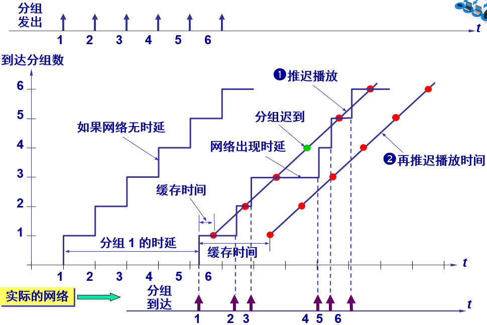

**需要解决的问题** 

在传送时延敏感 (delay sensitive) 的实时数据时，不仅传输时延不能太大，而且时延抖动也必须受到限制。

对于传送实时数据，很少量分组的丢失对播放效果的影响并不大（因为这是由人来进行主观评价的），因而是可以容忍的。

丢失容忍 (loss tolerant) 也是实时数据的另一个重要特点。  

由于分组的到达可能不按序，但将分组还原和播放时又应当是按序的，因此在发送多媒体分组时还应当给每一个分组加上序号。这表明还应当有相应的协议支持才行。

要使接收端能够将节目中本来就存在的正常的短时间停顿（如音乐中停顿几拍）和因某些分组的较大迟延造成的“停顿”区分开来，就需要增加一个时间戳 (timestamp)，以便告诉接收端应当在什么时间播放哪个分组。

**必须改造现有的互联网** 

大量使用光缆和高速路由器，网络的时延和时延抖动就可以足够小，在互联网上传送实时数据就不会有问题。
把互联网改造为能够对端到端的带宽实现预留 (reservation)，把使用无连接协议的互联网转变为面向连接的网络。 
部分改动互联网的协议栈所付出的代价较小，而这也能够使多媒体信息在互联网上的传输质量得到改进。 

**互联网提供的音频/视频服务类型** 

 目前互联网提供的音频/视频服务大体上可分为三种类型：

1.  流式 (streaming) 存储音频/视频 ——边下载边播放。
2.  流式实况音频/视频 ——边录制边发送 。
3.  交互式音频/视频 ——实时交互式通信。

**“边下载边播放”中的“下载”** 

对于流式音频/视频的“下载”，实际上并没有把“下载”的内容存储在硬盘上。
“边下载边播放”结束后，在用户的硬盘上没有留下有关播放内容的任何痕迹。
流媒体 (streaming media)即流式音频/视频。
流媒体特点就是“边下载边播放” (streaming and playing) 。

## 8.2  流式存储音频/视频

浏览器从服务器下载已经录制好的音频/视频文件步骤如下：

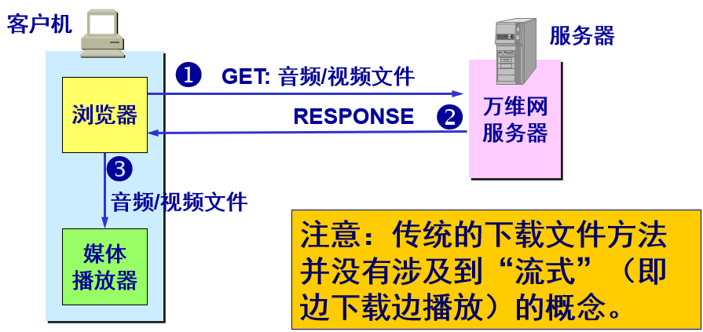

浏览器从服务器下载音频/视频文件步骤 

1. 用户从客户机 (client machine) 的浏览器上用 HTTP 协议向服务器请求下载某个音频/视频文件。
2. 服务器如有此文件就发送给浏览器。在响应报文中就装有用户所要的音频/视频文件。整个下载过程可能会花费很长的时间。
3. 当浏览器完全收下这个文件后，就可以传送给自己机器上的媒体播放器进行解压缩，然后播放。 

### 8.2.1  具有元文件的万维网服务器 

元文件就是一种非常小的文件，它描述或指明其他文件的一些重要信息。这里的元文件保存了有关这个音频/视频文件的信息。 

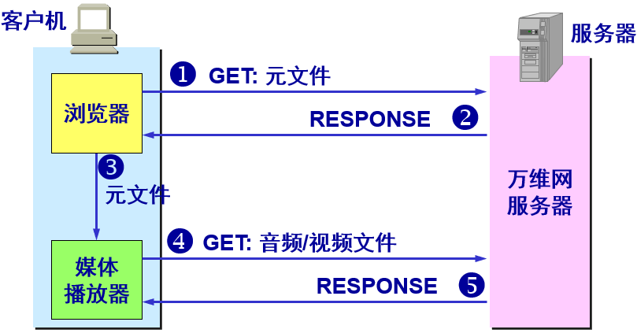

**使用元文件下载音频/视频文件** 

1. 浏览器用户使用 HTTP 的 GET 报文接入到万维网服务器。这个超链指向一个元文件。这个元文件有实际的音频/视频文件的统一资源定位符 URL。
2. 万维网服务器把该元文件装入 HTTP 响应报文的主体，发回给浏览器。
3. 客户机浏览器调用相关的媒体播放器，把提取出的元文件传送给媒体播放器。
4. 媒体播放器使用元文件中的 URL ，向万维网服务器发送 HTTP 请求报文，要求下载音频/视频文件。
5. 万维网服务器发送 HTTP 响应报文，把该音频/视频文件发送给媒体播放器。媒体播放器边下载边解压缩边播放。 

### 8.2.2  媒体服务器

- 媒体服务器也称为流式服务器 (streaming server)，它支持流式音频和视频的传送。
- 媒体播放器与媒体服务器的关系是客户与服务器的关系。 
- 媒体播放器不是向万维网服务器而是向媒体服务器请求音频/视频文件。
- 媒体服务器和媒体播放器之间采用另外的协议进行交互。  

**使用媒体服务器**

媒体播放器不是向万维网服务器而是向媒体服务器请求音频/视频文件。

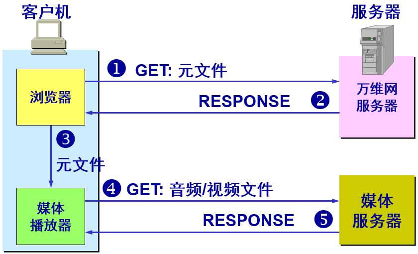

**使用媒体服务器下载音频/视频文件步骤**

1~3 前三个步骤仍然和上一节的一样，区别就是后面两个步骤。

4 媒体播放器使用元文件中的 URL 接入到媒体服务器，请求下载浏览器所请求的音频/视频文件。下载可以借助于使用 UDP 的任何协议，例如使用实时运输协议  RTP。

5 媒体服务器给出响应，把该音频/视频文件发送给媒体播放器。媒体播放器在迟延了若干秒后，以流的形式边下载边解压缩边播放。 

**使用 TCP，还是 UDP？**

传送音频/视频文件可以使用 TCP，也可以使用 UDP。起初人们选用 UDP 来传送。

采用 UDP 会有以下几个缺点：

- 由于网络的情况多变，在接收端的播放器很难做到始终按规定的速率播放。
- 很多单位的防火墙往往阻拦外部 UDP 分组的进入，因而使用 UDP 传送多媒体文件时会被防火墙阻拦掉。
- 使用 UDP 传送流式多媒体文件时，如果在用户端希望能够控制媒体的播放，如进行暂停、快进等操作，那么还需要使用另外的协议 RTP 和 RTSP，增加了成本和复杂性。

现在对流式存储音频/视频的播放，如 YouTube和Netflix1，都是采用 TCP 来传送。

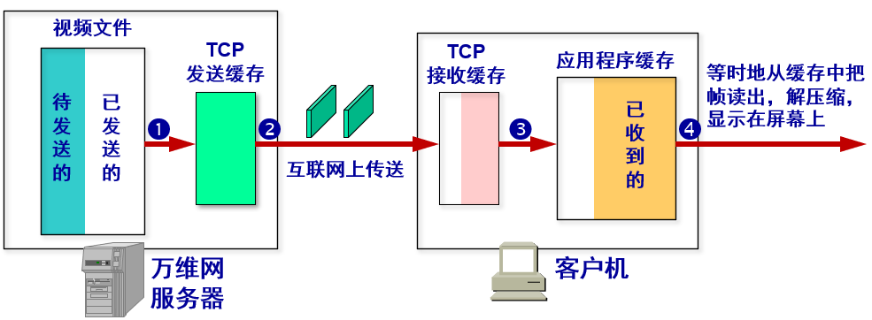

**使用 TCP 传送流式视频主要步骤**

1. 用户使用 HTTP 获取存储在万维网服务器中的视频文件，然后把视频数据传送到 TCP 发送缓存中。若发送缓存已填满，就暂时停止传送。
2. 从 TCP 发送缓存通过互联网向客户机中的 TCP 接收缓存传送视频数据，直到接收缓存被填满。
3. 从 TCP 接收缓存把视频数据再传送到应用程序缓存（即媒体播放器的缓存）。当这个缓存中的视频数据存储到一定程度时，就开始播放。这个过程一般不超过 1 分钟。
4. 在播放时，媒体播放器等时地（即周期性地）把视频数据按帧读出，经解压缩后，把视频节目显示在用户的屏幕上。

### 8.2.3  实时流式协议 RTSP

RTSP (Real-Time Streaming Protocol) 协议以客户服务器方式工作。它本身并不传送数据，是一个多媒体播放控制协议，用来使用户在播放从互联网下载的实时数据时能够进行控制，如：暂停/继续、后退、前进等。因此 RTSP 又称为“互联网录像机遥控协议”。

要实现 RTSP 的控制功能，我们不仅要有协议，而且要有专门的媒体播放器 (media player) 和媒体服务器 (media server)。 

**RTSP 特点**  

RTSP 是有状态的协议。它记录客户机所处于的状态（初始化状态、播放状态或暂停状态）。

RTSP 控制分组既可在 TCP 上传送，也可在 UDP 上传送。

RTSP 没有定义音频/视频的压缩方案，也没有规定音频/视频在网络中传送时应如何封装在分组中。

RTSP 没有规定音频/视频流在媒体播放器中应如何缓存。

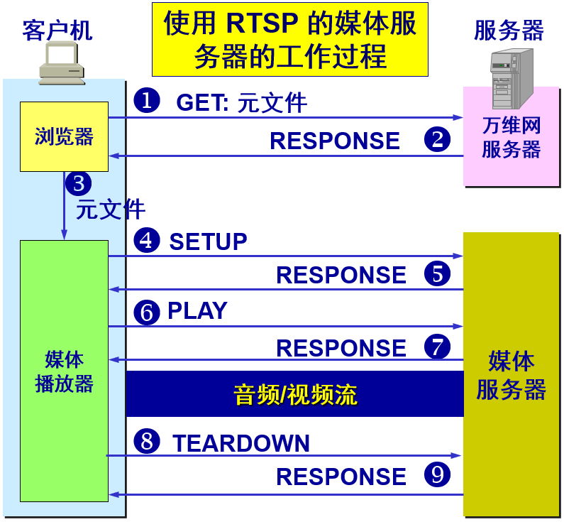

**使用 RTSP 的媒体服务器的工作过程** 

1. 浏览器向万维网服务器请求音频/视频文件。
2. 万维网服务器从浏览器发送携带有元文件的响应。
3. 浏览器把收到的元文件传送给媒体播放器。
4. RTSP 客户与媒体服务器的 RTSP 服务器建立连接。
5. RTSP 服务器发送响应 RESPONSE 报文。
6. RTSP 客户发送 PLAY 报文，开始下载音频/视频文件。
7.  RTSP 服务器发送响应 RESPONSE 报文。
8.  RTSP 客户发送 TEARDOWN 报文断开连接。
9. RTSP 服务器发送响应 RESPONSE 报文。 

## 8.3  交互式音频/视频

### 8.3.1  IP 电话概述

#### 1.狭义的和广义的 IP 电话

- 狭义的 IP 电话就是指在 IP 网络上打电话。所谓“IP 网络”就是“使用 IP 协议的分组交换网”的简称。
-  广义的 IP 电话则不仅仅是电话通信，而且还可以是在IP网络上进行交互式多媒体实时通信（包括话音、视像等），甚至还包括即时传信IM (Instant Messaging)。

#### 2. IP电话网关

20世纪90年代中期， VocalTec 公司率先推出了实用化的 IP 电话。但是这种 IP 电话必须使用PC。

1996年3月，VocalTec 公司成功地推出了 IP 电话网关（IP Telephony Gateway），它是公用电话网与IP网络的接口设备。

IP 电话网关的作用就是：

- (1) 在电话呼叫阶段和呼叫释放阶段进行电话信令的转换。
- (2) 在通话期间进行话音编码的转换。

**IP 电话网关的几种连接方法** 

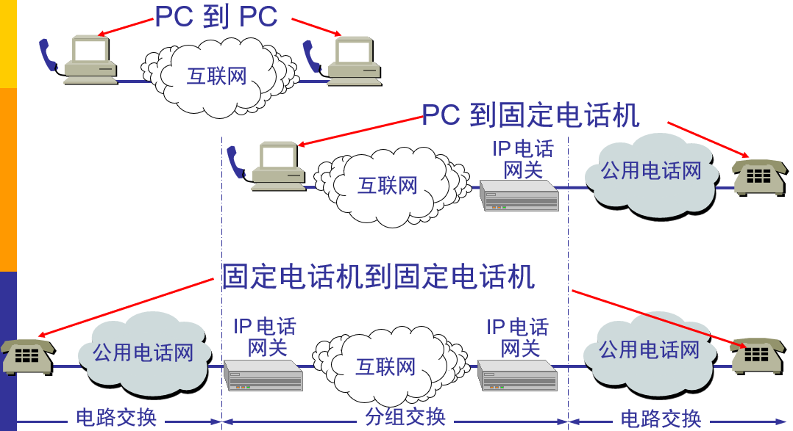

#### 3. IP 电话的通话质量

IP 电话的通话质量主要由两个因素决定：

- 一个是通话双方端到端的时延和时延抖动；
- 另一个是话音分组的丢失率。

但这两个因素是不确定的，取决于当时网络上的通信量。

经验证明，在电话交谈中，端到端的时延不应超过 250 ms，否则交谈者就能感到不自然。  

**IP 电话的端到端时延** 

(1) 话音信号进行模数转换要经受时延。
(2) 话音比特流装配成话音分组的时延。
(3) 话音分组的发送需要时间，此时间等于话音分 组长度与通信线路的数据率之比。
(4) 话音分组在因特网中的存储转发时延。
(5) 话音分组在接收端缓存中暂存所引起的时延。
(6) 话音分组还原成模拟话音信号的时延。
(7) 话音信号在通信线路上的传播时延。
(8) 终端设备的硬件和操作系统产生的接入时延。 

**低速率话音编码的 ITU-T 标准** 

(1) G.729——速率为 8 kb/s 的共轭结构代数码激励线性预测声码器 CS-ACELP (Conjugate-Structure Algebraic-Code-Excited Linear Prediction)。

(2) G.723.1——速率为 5.3/6.3 kb/s 的为多媒体通信用的低速率声码器。 

G.729 和 G.723.1 的主要性能比较

| 标准    | 比特率（kbit/s） | 帧大小（ms） | 处理时延（ms） | 帧长  （字节） | 数字信号处理  MIPS |
| ------- | ---------------- | ------------ | -------------- | -------------- | ------------------ |
| G.729   | 8                | 10           | 10             | 10             | 20                 |
| G.723.1 | 5.3/6.3          | 30           | 30             | 20/24          | 16                 |

**接收端的播放时延有一个最佳值**

在点 N 处，端到端时延和话音分组丢失率都是最小。但实际上并不可能工作在这个点上。

**线速路由器** 

提高路由器的转发分组的速率对提高 IP 电话的质量也是很重要的。

据统计，一个跨大西洋的 IP 电话一般要经过 2030 个路由器。

若能改用吉比特路由器（又称为线速路由器），则每秒可转发 5 百万至 6 千万个分组（即交换速率达 60 Gbit/s 左右）。这样还可进一步减少由网络造成的时延。 

**关于 Skype**

Skype 采用了 P2P 和全球索引技术提供快速路由选择机制，管理成本大大降低。由于用户路由信息分布式存储于因特网的结点中，因此呼叫连接完成得很快。

Skype 采用了端对端加密方式，保证信息的安全性。

Skype 使用 P2P 的技术，用户数据主要存储在 P2P 网络中，因此必须保证存储在公共网络中的数据是可靠的和没有被篡改的。Skype 对公共目录中存储的和用户相关的数据都采用了数字签名，保证了数据无法被篡改。

Skype 的问世给全球信息技术和通信产业带来深远的影响，也给每一位网络使用者带来生活方式的改变。 

### 8.3.2  IP 电话所需要的几种应用协议

在 IP 电话的通信中，至少需要两种应用协议：

- 一种是信令协议，它使我们能够在互联网上找到被叫用户。
- 另一种是话音分组的传送协议，它使我们用来进行电话通信的话音数据能够以时延敏感属性在互联网中传送。

为了在互联网中提供实时交互式的音频/视频服务，我们需要新的多媒体体系结构。

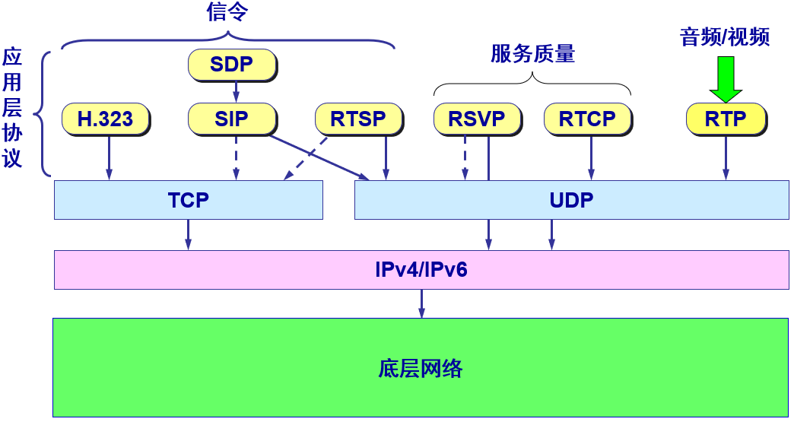

### 8.3.3  实时运输协议 RTP

实时运输协议 RTP (Real-time Transport Protocol) 为实时应用提供端到端的运输，但不提供任何服务质量的保证。

多媒体数据块经压缩编码处理后，先送给 RTP 封装成为 RTP 分组，再装入运输层的 UDP 用户数据报，然后再交给 IP 层。

RTP 是一个协议框架，只包含了实时应用的一些共同的功能。

RTP 自己并不对多媒体数据块做任何处理，而只是向应用层提供一些附加的信息，让应用层知道应当如何进行处理。  

**RTP 的层次** 

从应用开发者的角度看，RTP 应当是应用层的一部分。

在应用的发送端，开发者必须编写用 RTP 封装分组的程序代码，然后把 RTP 分组交给 UDP 插口接口。

在接收端，RTP 分组通过 UDP 插口接口进入应用层后，还要利用开发者编写的程序代码从 RTP 分组中把应用数据块提取出来。

**RTP 也可看成是运输层的一个子层** 

RTP 封装了多媒体应用的数据块。

由于 RTP 向多媒体应用程序提供了服务（如时间戳和序号），因此也可以将 RTP 看成是在 UDP 之上的一个运输层的子层。 

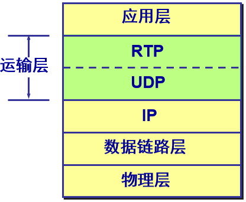

**RTP 分组的首部格式** 

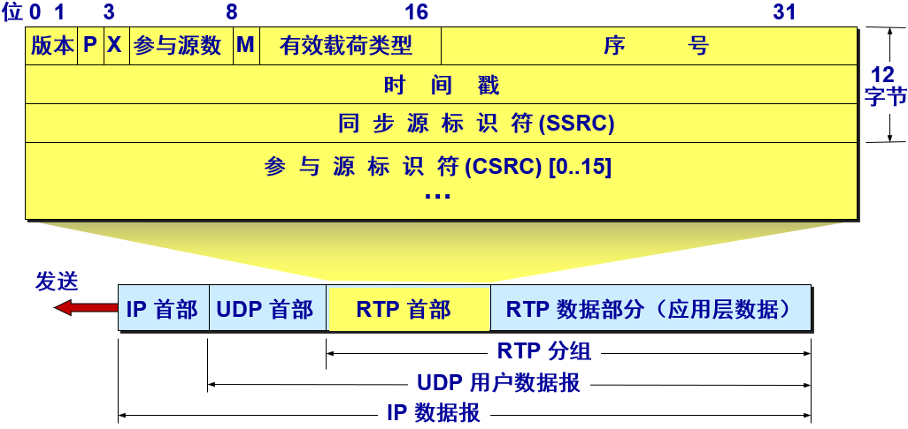

### 8.3.4  实时运输控制协议 RTCP

RTCP (RTP Control Protocol)是与 RTP 配合使用的协议。

RTCP 协议的主要功能：

- 服务质量的监视与反馈；
- 媒体间的同步；
- 播组中成员的标识。

RTCP 分组也使用 UDP 传送，但 RTCP 并不对声音或视像分组进行封装。

可将多个 RTCP 分组封装在一个 UDP 用户数据报中。

RTCP 分组周期性地在网上传送，它带有发送端和接收端对服务质量的统计信息报告。 

**RTCP 使用的五种分组类型** 

结束分组 BYE 表示关闭一个数据流。

特定应用分组 APP 使应用程序能够定义新的分组类型。

接收端报告分组 RR 用来使接收端周期性地向所有的点用多播方式进行报告。 

发送端报告分组 SR 用来使发送端周期性地向所有接收端用多播方式进行报告。

源点描述分组 SDES 给出会话中参加者的描述。  

### 8.3.5  H.323

H.323 是 ITU-T 于 1996 年制订的一个名称很长的建议书，1998 年的第二个版本改用的名称是“基于分组的多媒体通信系统”。

H.323 包括系统和构件的描述，呼叫模型的描述，呼叫信令过程，控制报文，复用，话音编解码器，视像编解码器，以及数据协议等，但不保证服务质量 QoS。  

**H.323 终端使用 H.323 协议进行多媒体通信** 

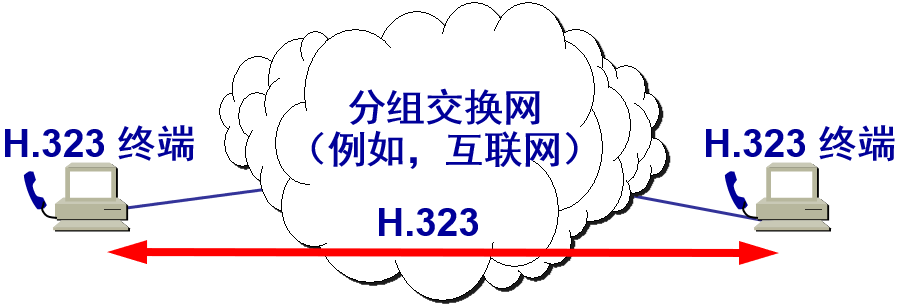

H.323 是互联网的端系统之间进行实时声音和视频会议的标准。
请注意，H.323 不是一个单独的协议而是一组协议。

**H.323 标准指明的四种构件** 

(1) H.323 终端
(2) 网关 —— 网关连接到两种不同的网络，使 H.323 网络可以和非 H.323 网络进行通信。
(3) 网闸 (gatekeeper) ——所有的呼叫都要通过网闸，因为网闸提供地址转换、授权、带宽管理和计费功能。
(4) 多点控制单元 MCU (Multipoint Control Unit) —— MCU 支持三个或更多的 H.323 终端的音频或视频会议。 

**用 H.323 网关连接非 H.323 网络**

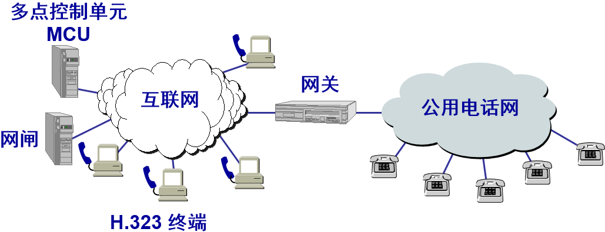

**H.323 的协议体系结构** 

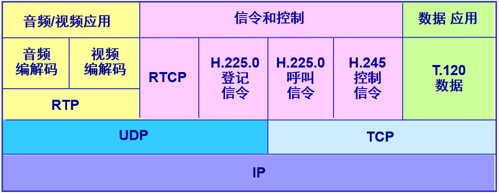

### 8.3.6  会话发起协议 SIP

H.323 过于复杂，不便于发展基于 IP 的新业务。

SIP (Session Initiation Protocol) 是一套较为简单且实用的标准，目前已成为互联网的建议标准。

SIP 协议以互联网为基础，把 IP 电话视为互联网上的新应用。

SIP 协议只涉及到 IP 电话的信令和有关服务质量问题，而没有提供像H.323那样多的功能。

SIP 没有指定使用 RTP 协议，但实际上大家还是选用 RTP 和 RTCP 作为配合使用的协议。  

**SIP 系统的构件**

SIP 使用文本方式的客户服务器协议。

SIP 系统的两种构件是用户代理和网络服务器。

用户代理包括用户代理客户和用户代理服务器，前者用来发起呼叫，而后者用来接受呼叫。

网络服务器分为代理服务器和重定向服务器。

- 代理服务器接受来自主叫用户的呼叫请求，并将其转发给下一跳代理服务器，最后将呼叫请求转发给被叫用户。
- 重定向服务器不接受呼叫，它通过响应告诉客户下一跳代理服务器的地址，由客户按此地址向下一跳代理服务器重新发送呼叫请求。

**SIP 的地址十分灵活**

可以是电话号码，也可以是电子邮件地址、IP 地址或其他类型的地址。但一定要使用 SIP 的地址格式，例如：
	电话号码    
   		sip:zhangsan@8625-87654321
	IPv4 地址    
		sip:zhangsan@201.12.34.56
	电子邮件地址
		sip:zhangsan@public1.ptt.js.cn

**SIP 特点**

和 HTTP 相似，SIP 是基于报文的协议。
SIP 使用了 HTTP 的许多首部、编码规则、差错码以及一些鉴别机制。
它比 H.323 具有更好的可扩缩性。

**一个简单的 SIP 会话** 

SIP 的会话共有三个阶段：建立会话、通信和终止会话。

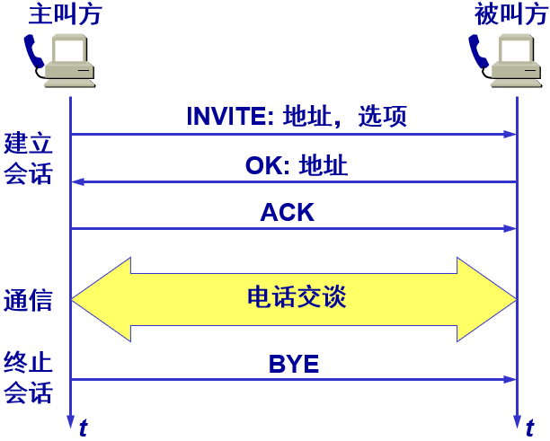

**SIP 登记器的用途：跟踪被叫方**  

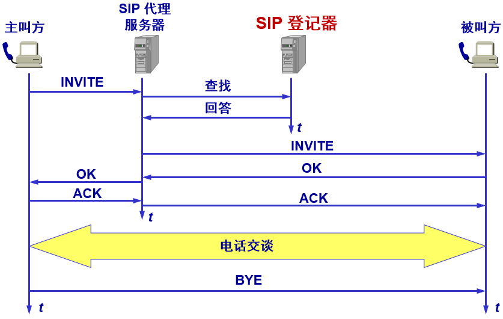

**会话描述协议 SDP**  

SDP (Session Description Protocol) 在电话会议的情况下特别重要，因为电话会议的参加者是动态地加入和退出。

SDP 详细地指明了媒体编码、协议的端口号以及多播地址。

SDP 现在也是互联网建议标准。

## 8.4  改进“尽最大努力交付”的服务

### 8.4.1  使互联网提供服务质量

服务质量 QoS 是服务性能的总效果，此效果决定了一个用户对服务的满意程度。因此在最简单的意义上，有服务质量的服务就是能够满足用户的应用需求的服务。

服务质量可用若干基本的性能指标来描述，包括：可用性、差错率、响应时间、吞吐量、分组丢失率、连接建立时间、故障检测和改正时间等。

服务提供者可向其用户保证某一种等级的服务质量。  

**主机 H1 和 H2 分别向主机 H3 和 H4 发送数据** 

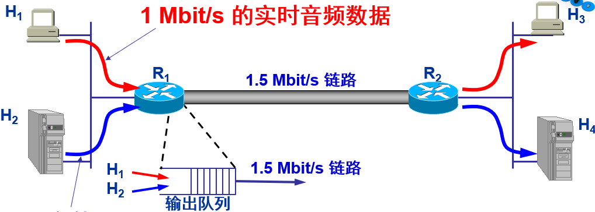

**FTP 文件数据** 

需要给不同性质的分组打上不同的标记。当 H1 和 H2 的分组进入 R1 时， R1 应能识别实时数据分组，并使这些分组以高优先级进入输出队列，而仅在队列有多余空间时才准许低优先级的 FTP 数据分组进入。 

**高优先级的 FTP 文件数据** 

应当使路由器增加分类 (classification) 机制，即路由器根据某些准则（例如，根据发送数据的地址）对输入分组进行分类，然后对不同类别的通信量给予不同的优先级。 

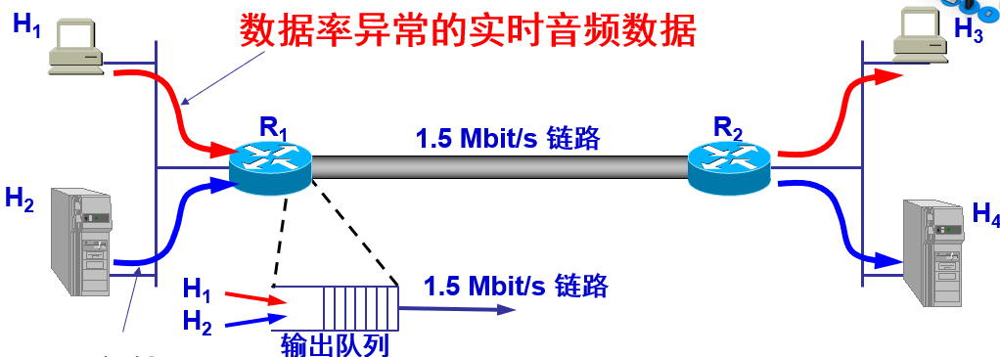

**FTP 文件数据** 

路由器应能将对数据流进行通信量的管制 (policing)，使该数据流不影响其他正常数据流在网络中通过。例如，可将 H1 的数据率限定为 1 Mbit/s。R1 不停地监视 H1 的数据率。只要其数据率超过规定的 1 Mbit/s，R1 就将其中的某些分组丢弃。 

**FTP 文件数据** 

应在路由器中再增加调度 (scheduling) 机制。利用调度功能给实时音频分配 1.0 Mbit/s 的带宽，给文件传送分配 0.5 Mbit/s 的带宽（相当于在带宽为 1.5 Mbit/s 的链路中划分出两个逻辑链路），因而对这两种应用都有相应的服务质量保证。 

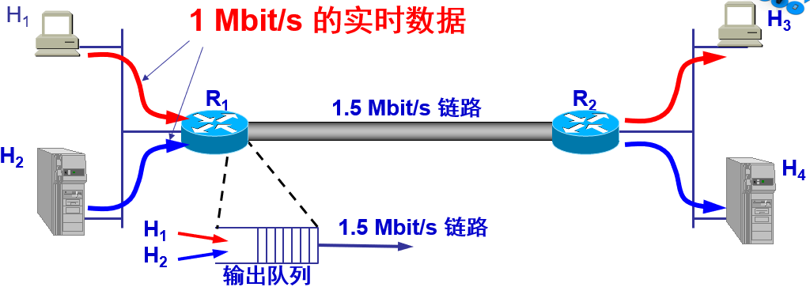

总数据率已超过了 1.5 Mbit/s 链路的带宽。比较合理的做法是让一个数据流通过 1.5 Mbit/s 的链路，而阻止另一个数据流的通过。这就需要呼叫接纳 (call admission) 机制。数据流要预先声明所需的服务质量，然后或者被准许进入网络，或者被拒绝进入网络。 

### 8.4.2  调度和管制机制

#### 1. 调度机制 

“调度”就是指排队的规则。

如不采用专门的调度机制，则默认排队规则就是先进先出 FIFO (First In First Out)。当队列已满时，后到达的分组就被丢弃。

先进先出的最大缺点是：不能区分时间敏感分组和一般数据分组，并且也不公平。

在先进先出的基础上增加按优先级排队，就能使优先级高的分组优先得到服务。  

**分组按优先级排队**

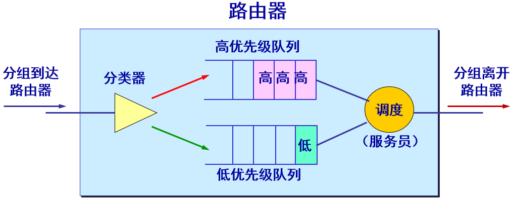

**高优先级分组优先接受服务**

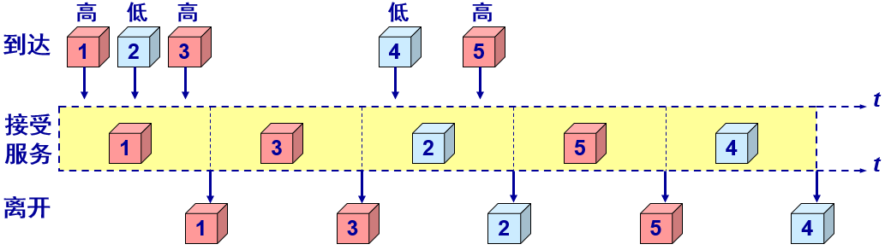

简单地按优先级排队会带来一个缺点：在高优先级队列中总是有分组时，低优先级队列中的分组就长期得不到服务。这就不太公平。

**公平排队 FQ (Fair Queuing)**

但公平排队也有不公平的地方，这就是长分组得到的服务时间长，而短分组就比较吃亏，并且公平排队并没有区分分组的优先级。

**加权公平排队 WFQ**

在公平队列 (FQ) 基础上，加权公平排队 WFQ (Weighted Fair Queuing) 增加了队列“权重”的概念，使高优先级队列中的分组有更多的机会得到服务

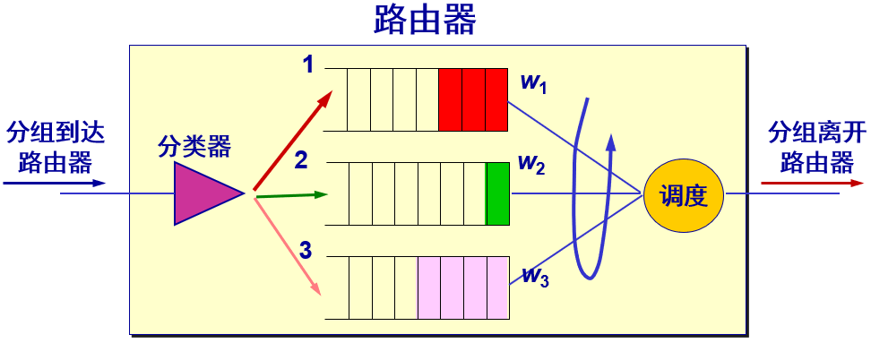

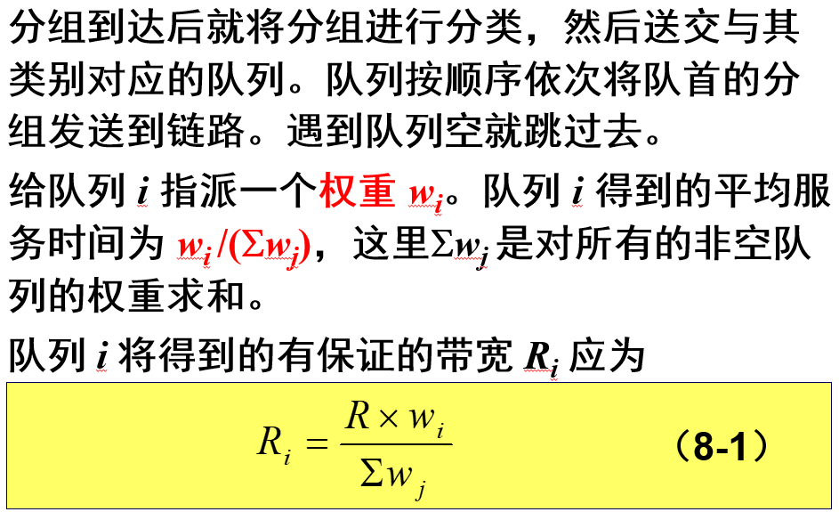

**WFQ 与 FIFO 的比较**

分组流 1 的权重是 0.5（即得到服务的时间占总的服务时间的一半），分配给其他 10 个分组流的权重都各为 0.05。

(a) 分组流 1 的分组连续输入

 

(b) 分组流 1 的分组断续输入

#### 2. 管制机制 

(1) 平均速率    网络需要控制一个数据流的平均速率。这里的平均速率是指在一定的时间间隔内通过的分组数。 
(2) 峰值速率    峰值速率限制了数据流在非常短的时间间隔内的流量。 
(3) 突发长度    网络也限制在非常短的时间间隔内连续注入到网络中的分组数。 

**漏桶管制器**

漏桶管制器 (leaky bucket policer) 
可以管制分组流进入网络。

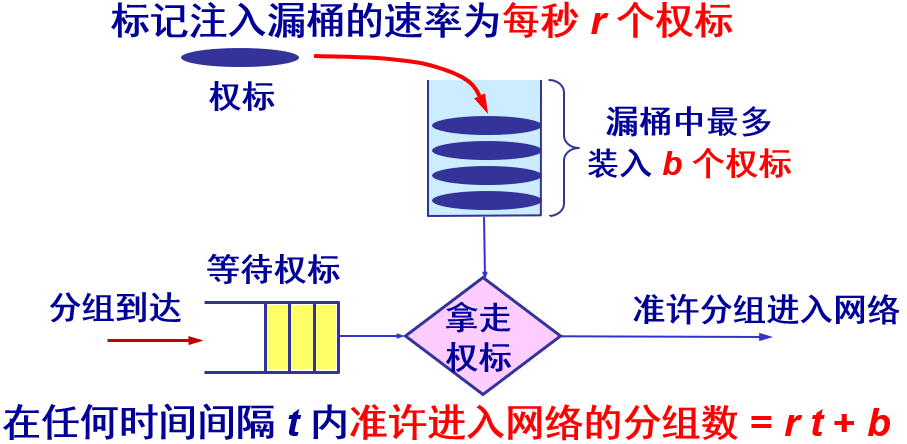

#### 3. 漏桶机制与加权公平排队相结合 

把漏桶机制与加权公平排队结合起来，可以控制队列中的最大时延。
现假定有 n 个分组流输入到一个路由器，复用后从一条链路输出。每一个分组流使用漏桶机制进行管制，漏桶参数为 bi  和 ri ，i = 1, 2, …, n。
设漏桶 i 已装满了 bi 个权标。因此 bi 个分组可马上从路由器输出。但分组流 i 得到的带宽是由公式(8-1)给出。这 bi 个分组中的最后一个分组所经受的时延最大，它等于传输这 bi 个分组所需的时间 dmax，即 bi 除以公式 (8-1) 给出的传输速率：  

**用漏桶机制进行管制** 

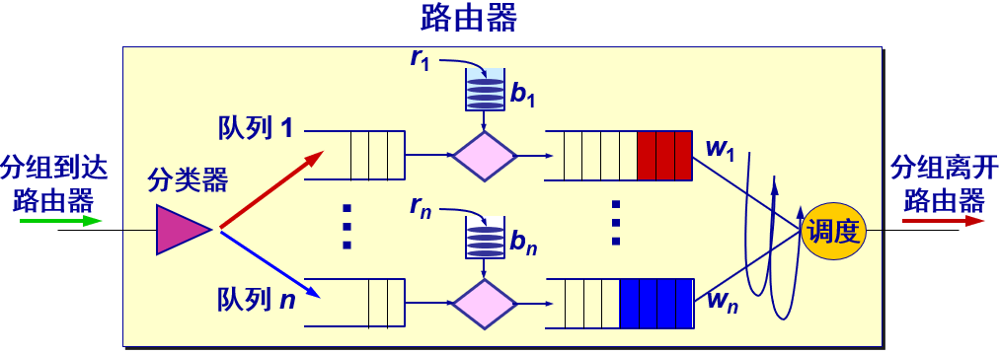

### 8.4.3  综合服务 IntServ 与资源预留协议 RSVP

综合服务 IntServ (Integrated Services) 可对单个的应用会话提供服务质量的保证，其主要特点有2个：

1. 资源预留。路由器需要知道不断出现的会话已预留了多少资源（即链路带宽和缓存空间）。
2. 呼叫建立。需要服务质量保证的会话必须首先在源站到目的站的路径上的每个路由器预留足够的资源，以保证其端到端的服务质量要求。   

**IntServ 定义了两类服务** 

有保证的服务 (guaranteed service)可保证一个分组在通过路由器时的排队时延有一个严格的上限。

受控负载的服务(controlled-load service)可以使应用程序得到比通常的“尽最大努力”更加可靠的服务。

**IntServ 由四个组成部分**

(1) 资源预留协议 RSVP，它是 IntServ 的信令协议。
(2) 接纳控制 (admission control)，用来决定是否同意对某一资源的请求。
(3) 分类器 (classifier)，用来将进入路由器的分组进行分类，并根据分类的结果将不同类别的分组放入特定的队列。
(4) 调度器 (scheduler)，根据服务质量要求决定分组发送的前后顺序。

**流 (flow)**

“流”是在多媒体通信中的一个常用的名词，一般定义为：
	具有同样的源 IP 地址、源端口号、目的 IP 地址、目的端口号、协议标识符以及服务质量需求的一连串分组。 

**资源预留协议 RSVP**

一个会话必须首先声明它所需的服务质量，以便使路由器能够确定是否有足够的资源来满足该会话的需求。

当请求被接受时，链路带宽和缓存空间就被分配给这个分组流。

资源预留协议 RSVP 在进行资源预留时采用了多播树的方式。

**RSVP 协议的工作原理** 

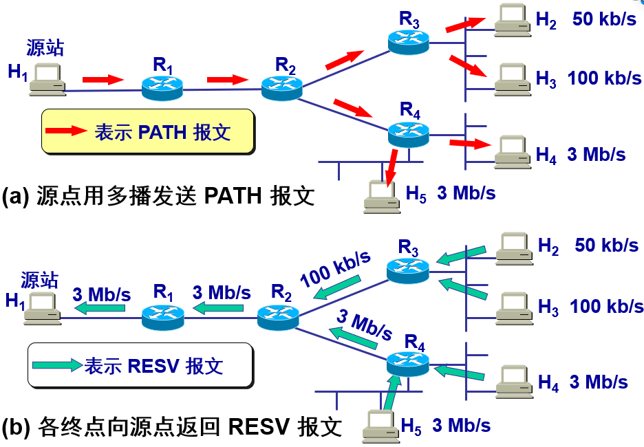

**IntServ 体系结构在路由器中的实现** 

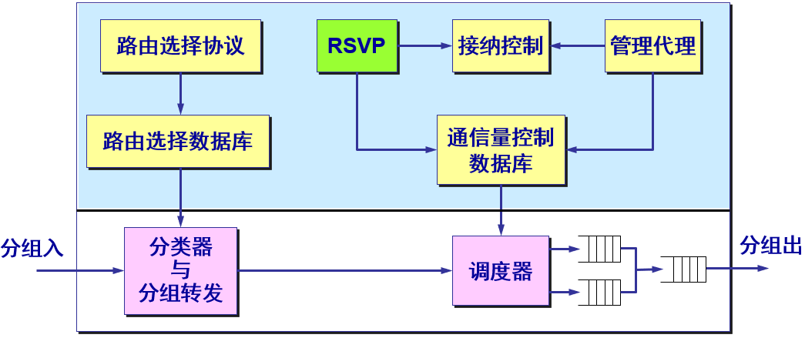

IntServ / RSVP 所基于的概念是端系统中与分组流有关的状态信息。各路由器中的预留信息只存储有限的时间（这称为软状态 soft-state），因而各终点对这些预留信息必须定期进行更新。

还应注意到，RSVP 协议不是运输层协议而是个网络层的控制协议。

RSVP 不携带应用数据。

**综合服务 IntServ 体系结构存在的主要问题** 

(1) 状态信息的数量与流的数目成正比。因此在大型网络中，按每个流进行资源预留会产生很大的开销。
(2) IntServ 体系结构复杂。若要得到有保证的服务，所有的路由器都必须装有 RSVP、接纳控制、分类器和调度器。
(3) 综合服务 IntServ 所定义的服务质量等级数量太少，不够灵活。 

### 8.4.4  区分服务 DiffServ

#### 1.区分服务的基本概念

由于综合服务 IntServ 和资源预留协议 RSVP 都较复杂，很难在大规模的网络中实现，因此  IETF 提出了新的策略，即区分服务 DiffServ 。

区分服务 DiffServ (Differentiated Services)有时也简写为 DS。因此，具有区分服务功能的结点就称为 DS 结点。 

**区分服务 DiffServ 的要点** 

(1) DiffServ 力图不改变网络的基础结构，但在路由器中增加区分服务的功能。

- DiffServ 将 IPv4 协议中原有的服务类型字段和 IPv6 的通信量类字段定义为区分服务字段 DS。路由器根据 DS 字段的值来转发分组。利用 DS 字段可提供不同等级的服务质量。
- DS 字段现只使用前 6 bit，即区分服务码点 DSCP (Differentiated Services CodePoint)。 

**服务等级协定 SLA**

在使用 DS 字段之前，互联网的 ISP 要和用户商定一个服务等级协定 SLA (Service Level Agreement)。

在 SLA 中指明了被支持的服务类别（可包括吞吐量、分组丢失率、时延和时延抖动、网络的可用性等）和每一类所容许的通信量。 

**区分服务 DiffServ 的要点**

 (2) 网络被划分为许多个 DS 域。

DiffServ 将所有的复杂性放在 DS 域的边界结点(boundary node)中，而使 DS 域内部路由器工作得尽可能地简单。  

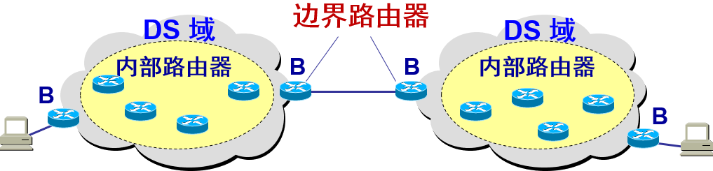

(3) 边界路由器中的功能功能较多。

可分为两大部分：

- 分类器 (classifier)

- 通信量调节器 (conditioner) 
  - 标记器 (marker)
  - 整形器 (shaper)
  - 测定器 (meter)

**边界路由器中的各功能块的关系** 

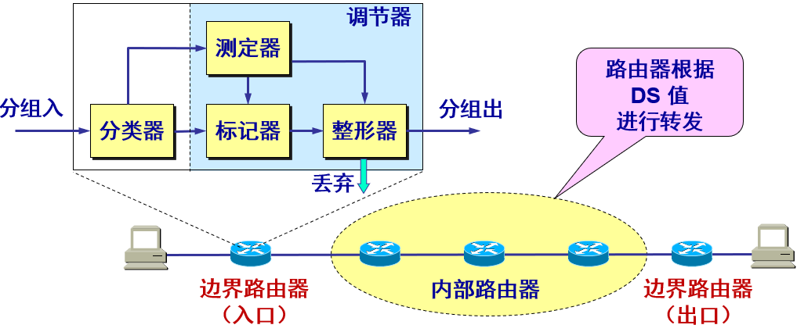

(4) 聚合 (aggregation)

DiffServ 不是为网络中的每一个流维持供转发时使用的状态信息，而是将若干个流根据其 DS 值聚合成少量的流。

路由器对相同 DS 值的流都按相同的优先级进行转发。这就大大简化了网络内部的路由器的转发机制。

区分服务 DiffServ 不需要使用 RSVP 信令。 

#### 2. 每跳行为 PHB (Per-Hop Behavior) 

“行为”就是指在转发分组时路由器对分组是怎样处理的。

“每跳”是强调这里所说的行为只涉及到本路由器转发的这一跳的行为，而下一个路由器再怎样处理则与本路由器的处理无关。

这和 IntServ / RSVP 考虑的服务质量是“端到端”的很不一样。 

**DiffServ 定义的两种 PHB** 

迅速转发 PBH，即 EF PHB，或 EF。

EF 指明离开一个路由器的通信量的数据率必须等于或大于某一数值。因此 EF PHB 用来构造通过 DS 域的低丢失率、低时延、低时延抖动、确保带宽的端到端服务（即不排队或很少排队） 。

这种服务对端点来说像点对点连接或“虚拟租用线”，又称为 Premium（优质）服务。

**区分服务 DiffServ**

从以上所述可看出，区分服务 DiffServ 比较灵活，因为它并没有定义特定的服务或服务类别。

当新的服务类别出现而旧的服务类别不再使用时，DiffServ 仍然可以工作。